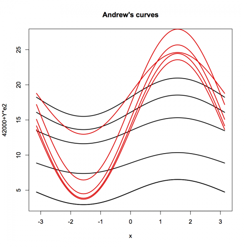

##  **SMSandcurpopu**


```yaml
Name of Quantlet: SMSandcurpopu

Published in: Multivariate Statistics: Exercises and Solutions

Description: 'Produces plot of Andrews curves from the annual population dataset (annualpopu.rda) to detect homogeneous subgroups and multidimensional outliers. Apparently, there are 2 subgroups, years 1975 to 1979 form a cluster with higher values, years 1970 to 1974 form a group with lower values.'

Keywords: Andrews curves, curve, data visualization, graphical representation, multi-dimensional, plot, visualization

See also: 'SMSboxbank6, SMSboxbank6, SMSboxcar, SMSboxcar, SMSboxunemp, SMSboxunemp, SMSdenbank, SMSdenbank, SMSdrafcar, SMSdrafcar, SMSfacenorm, SMSfacenorm, SMShiscar, SMShiscar, SMShisheights, SMShisheights, SMSpcpcar, SMSpcpcar, SMSscanorm2, SMSscanorm3, SMSscanorm3, SMSscapopu, SMSscapopu'

Author: Tomas Hovorka

Submitted:  Fri, August 07 2015 by Awdesch Melzer

Datafile[r]: annualpopu.rda
Datafile[m]: annualpopu.dat

Example: Andrew's curves of annual population data detecting two subgroups: 1975-1979 with higher values and 1970-1974 with lower values of unemployment

```





```R
# clear variables and close windows
graphics.off()
rm(list=ls(all=TRUE))

# setwd("C:/...")   # set your working directory

load("annualpopu.rda")  # load data

t      = annualpopu[10:19,2:3] # pic 10 observarions from variables 2 and 3
a      = 1 # colour = black
b      = 2 # colour = red
colour = c(rep(a,5),rep(b,5)) # define colour-dummy for plot 
curve((t[1,1]/sqrt(2)+t[1,2]*sin(x)-42000)/100,-pi,pi,lwd=2,ylim=c(3,27),ylab="42000+Y*e2",main="Andrew's curves")
for(i in 1:10){curve((t[i,1]/sqrt(2)+t[i,2]*sin(x)-42000)/100,-pi,pi,add=TRUE,lwd=2,col=colour[i])}

```

```Matlab

% clear history
clear all
close all
clc

% load data
load annualpopu.dat

% extract specific variables
t      = annualpopu(10:19,2:3);

% standardization
[n m]  = size(t);
for i  = 1:n
    z(i,:) = (t(i,:)-mean(t))./sqrt((n-1)*var(t)/n);
end

% interval
x      = -pi:0.01:pi;

% data transformation for andrewslines
zt     = (t(1,1)/sqrt(2)+t(1,2)*sin(x)-42000)/100;

% plot
hold on
plot(x,zt,'LineWidth',2,'Color','k','LineStyle','-') 
for i = 1:5
    zt     = (t(i,1)/sqrt(2)+t(i,2).*sin(x)-42000)/100;
    plot(x,zt,'LineWidth',2,'Color','k','LineStyle','-')
end
for i = 6:10
    zt     = (t(i,1)/sqrt(2)+t(i,2).*sin(x)-42000)/100;
    plot(x,zt,'LineWidth',2,'Color','r','LineStyle',':')
end
title('Andrews curves (Annual population data)','FontSize',16,'FontWeight','Bold')
ylim([2,29])
xlim([-pi,pi])
ylabel('42000+Y*e2','FontSize',16,'FontWeight','Bold')
xlabel('X','FontSize',16,'FontWeight','Bold')
box on
set(gca,'LineWidth',1.6,'FontSize',16,'FontWeight','Bold')
hold off

% to save plot please uncomment following lines 
% print -painters -dpng -r600 SMSandcurpopu.png
% print -painters -dpdf -r600 SMSandcurpopu.pdf

```