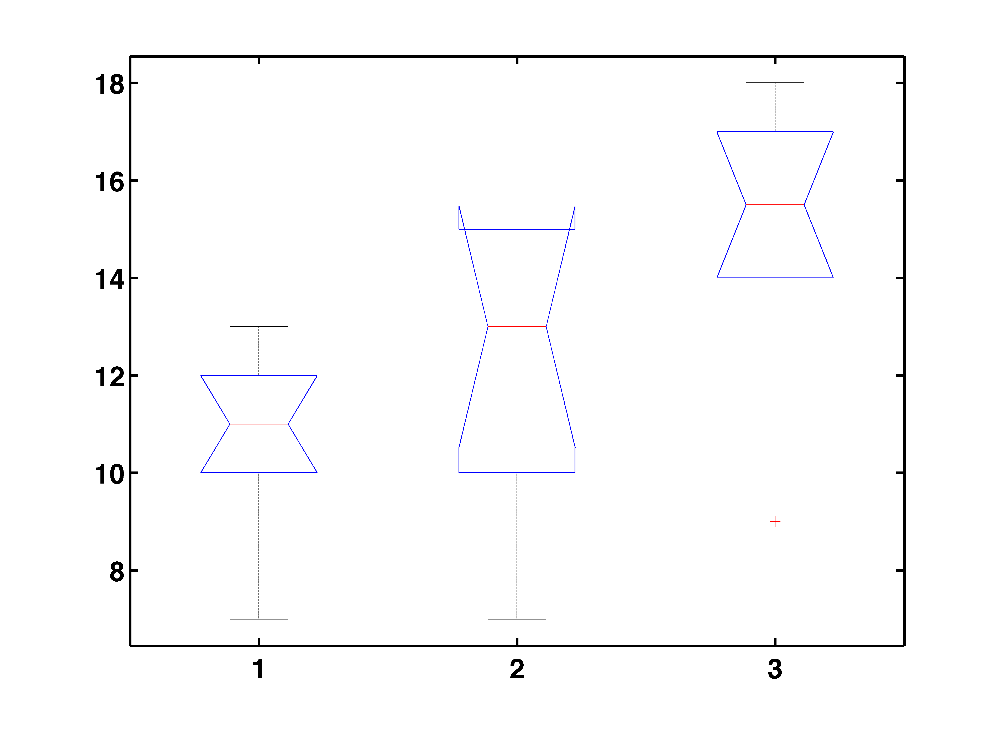
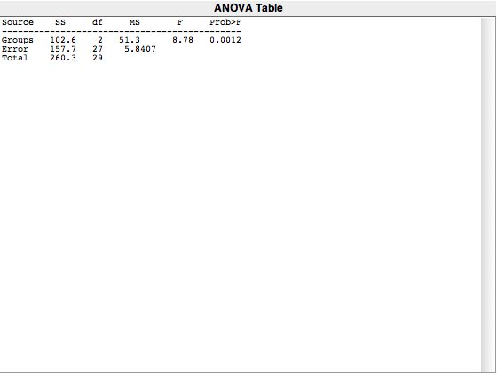

```yaml


 Example[r]: 'Analysis of Variance Table

 anova(lm1)
 Analysis of Variance Table

 Response: y
           Df Sum Sq Mean Sq F value   Pr(>F)   
 x          2  102.6  51.300  8.7831 0.001153 **
 Residuals 27  157.7   5.841                    
 ---
 Signif. codes:  0 ‘***’ 0.001 ‘**’ 0.01 ‘*’ 0.05 ‘.’ 0.1 ‘ ’ 1


 summary(lm1)
 Call:
 lm(formula = y ~ x)

 Residuals:
    Min     1Q Median     3Q    Max 
   -6.1   -1.1    0.4    1.9    2.9 

 Coefficients:
           # Estimate Std. Error t value Pr(>|t|)    
 (Intercept)  10.6000     0.7642  13.870 8.44e-14 ***
 x2            1.8000     1.0808   1.665 0.107392    
 x3            4.5000     1.0808   4.164 0.000287 ***
 ---
 Signif. codes:  0 ‘***’ 0.001 ‘**’ 0.01 ‘*’ 0.05 ‘.’ 0.1 ‘ ’ 1

 Residual standard error: 2.417 on 27 degrees of freedom
 Multiple R-squared:  0.3942,	Adjusted R-squared:  0.3493 
 F-statistic: 8.783 on 2 and 27 DF,  p-value: 0.001153'
```





