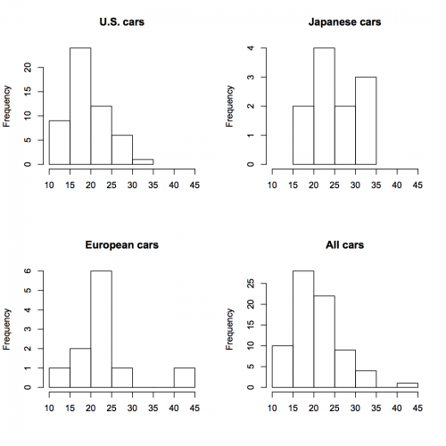

[](http://quantlet.de/index.php?p=info)

## [](http://quantlet.de/) **SMShiscar** [](http://quantlet.de/d3/ia)


```yaml

Name of Quantlet: SMShiscar

Published in: Multivariate Statistics: Exercises and Solutions

Description: 'Computes 4 histograms of mileage of US, Japanese, and European cars (carc.txt data). The histograms are different w.r.t. the group.'

Keywords: data visualization, empirical, graphical representation, histogram, plot, visualization

See also: 'SMSandcurpopu, SMSboxbank6, SMSboxunemp, SMSboxunemp, SMSdenbank, SMSdenbank, SMSdrafcar, SMSdrafcar, SMSfacenorm, SMSfacenorm, SMShiscar, SMShiscar, SMShisheights, SMShisheights, SMSpcpcar, SMSpcpcar, SMSscanorm2, SMSscanorm3, SMSscanorm3, SMSscapopu, SMSscapopu'

Author[r]: Wolfgang K. Härdle, Zdenek Hlávka, Dedy D. Prastyo
Author[m]: Wolfgang K. Härdle, Zdenek Hlávka, Dedy D. Prastyo

Submitted:  Fri, August 07 2015 by Awdesch Melzer

Datafile[r]: carc.rda
Datafile[m]: carc.txt

Example: 'Computes 4 histograms of mileage of US, Japanese, and European cars (carc.txt data). The histograms are different w.r.t. the group.'
```





```R
rm(list=ls(all=TRUE))
graphics.off()

load("carc.rda")   # load data

opar=par(mfrow=c(2,2))
hist(carc$M[carc$C=="US"],     main="U.S. cars",     xlim=c(10,45), xlab="")
hist(carc$M[carc$C=="Japan"],  main="Japanese cars", xlim=c(10,45), xlab="")
hist(carc$M[carc$C=="Europe"], main="European cars", xlim=c(10,45), xlab="")
hist(carc$M,                   main="All cars",      xlim=c(10,45), xlab="")
par(opar)
```
