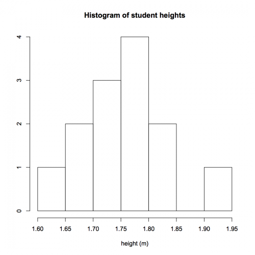

[](http://quantlet.de/index.php?p=info)

## [](http://quantlet.de/) **SMShisheights** [](http://quantlet.de/d3/ia)


```yaml

Name of Quantlet: SMShisheights

Published in: Multivariate Statistics: Exercises and Solutions

Description: 'Computes a simple histogram for the height of students. SMShisheights computes a histogram for the height of students with binwidth 0.05 meters and origin 1.6m.'

Keywords: binwidth, data visualization, empirical, graphical representation, histogram, visualization, density

See also: 'SMSandcurpopu, SMSboxbank6, SMSboxunemp, SMSboxunemp, SMSdenbank, SMSdenbank, SMSdrafcar, SMSdrafcar, SMSfacenorm, SMSfacenorm, SMShiscar, SMShiscar, SMShisheights, SMShisheights, SMSpcpcar, SMSpcpcar, SMSscanorm2, SMSscanorm3, SMSscanorm3, SMSscapopu, SMSscapopu'

Author[r]: Tomas Hovorka
Author[m]: Awdesch Melzer

Submitted:  Fri, August 07 2015 by Awdesch Melzer

Example: 'Histogram of heights of students with binwidth of 0.05 meters and origin 1.6m.'
```





```R
rm(list=ls(all=TRUE))
graphics.off()

x  =  c(1.72,1.83,1.74,1.79,1.94,1.71,1.66,1.60,1.78,1.77,1.85,1.70,1.76)
hist(x, breaks=seq(1.6,1.95,0.05), xlab="height (m)", ylab="", main = "Histogram of student heights")
```
