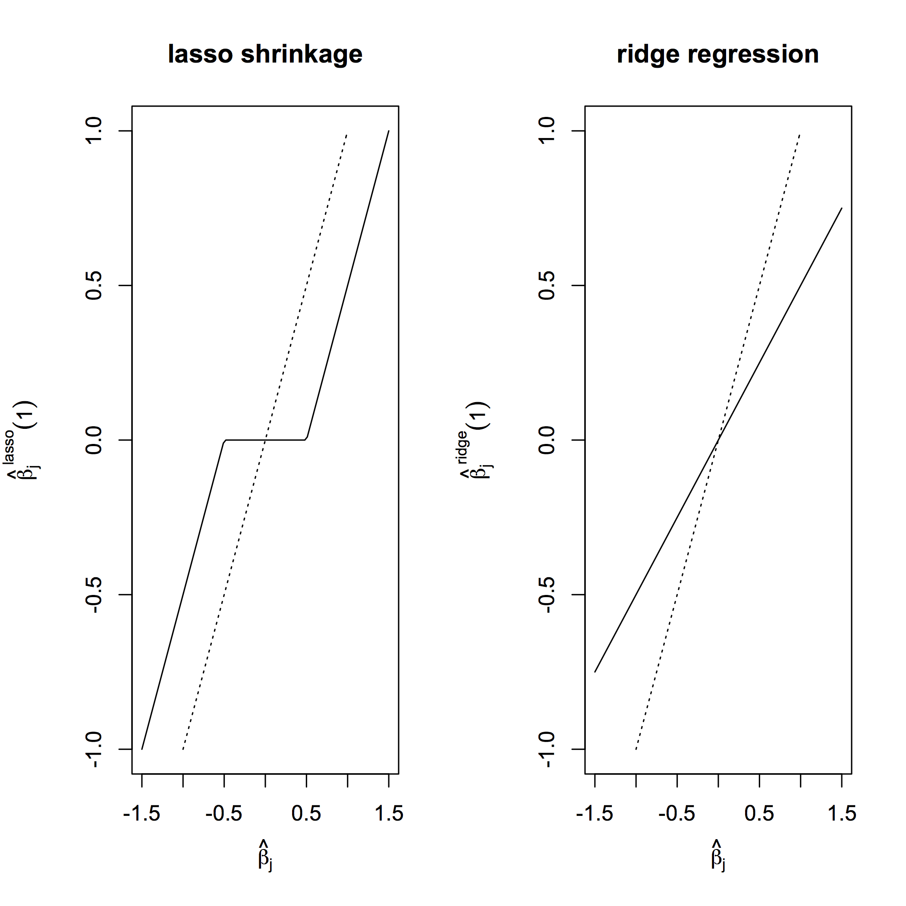

[](http://quantlet.de/index.php?p=info)

## [](http://quantlet.de/) **SMSlinregbank2** [](http://quantlet.de/d3/ia)


```yaml
Name of Quantlet: SMSlassoridge

Published in: Multivariate Statistics: Exercises and Solutions Series 

Description: 'Compares a lasso shrinkage regression with ridge regression'

Keywords: 'lasso, ridge regression, lasso shrinkage'

See also: 'SMSlassocar, SMSlassologit, SMSlinregcar, SMSlinregcar2, SMSlogitbankrupt'

Author: Zdenek Hlavka

Datafile: carc.rda

Example[r]: 'Comparison of a lasso shrinkage regression with ridge regression'

```





```R
 # clear variables, close windows
rm(list=ls(all=TRUE))
graphics.off()

oldpar=par(mfrow=c(1,2),mar=c(5, 5, 4, 2) + 0.1,cex.axis=1,cex.lab=1)
# lasso beta (as function of ols beta)
l=1
curve(sign(x)*pmax(0,(abs(x)-l/2)),from=-1.5,to=1.5,xlab=expression(hat(beta)[j]),ylab=expression(paste(hat(beta)[j],atop(scriptstyle(lasso), phantom(0)), (1))),main="lasso shrinkage",ylim=c(-1,1),xlim=c(-1.5,1.5))
curve(I(x),add=TRUE,lty=3,from=-1,to=1)
# ridge beta (as function of ols beta)
curve(x/(1+l),from=-1.5,to=1.5,xlab=expression(hat(beta)[j]),ylab=expression(paste(hat(beta)[j],atop(scriptstyle(ridge), phantom(0)), (1))),main="ridge regression",ylim=c(-1,1),xlim=c(-1.5,1.5))
curve(I(x),add=TRUE,lty=3,from=-1,to=1)
par(oldpar)

```
