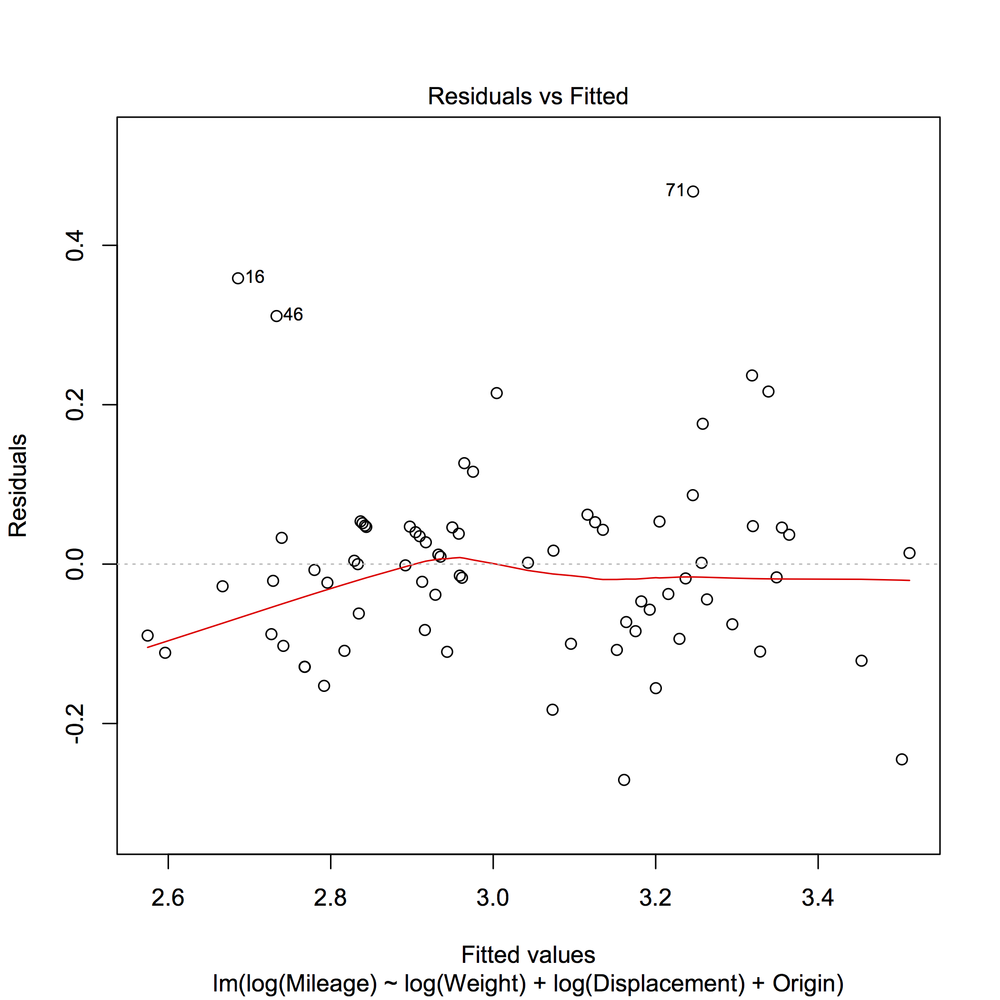
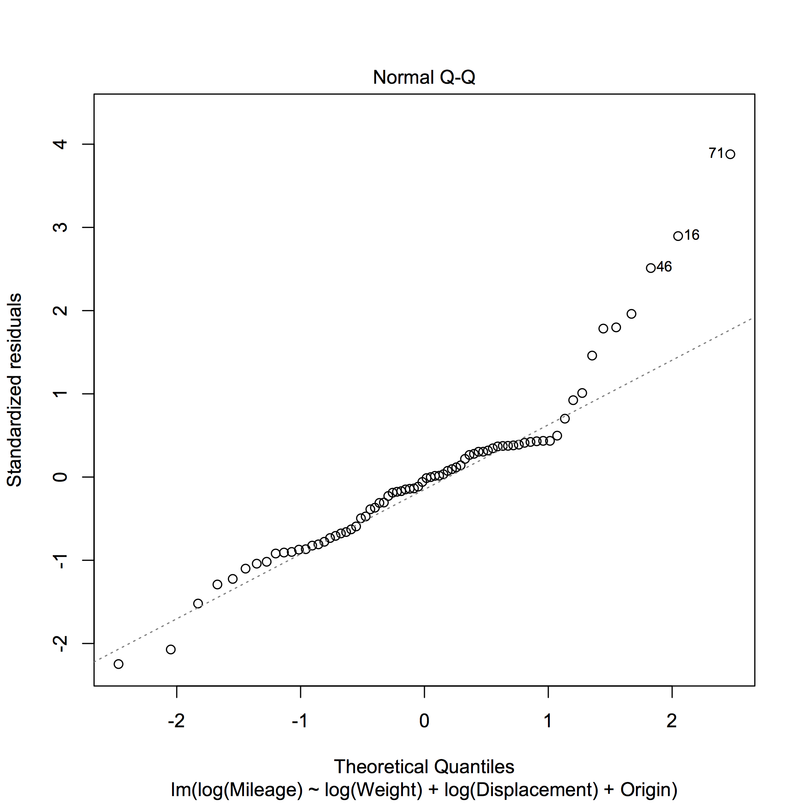
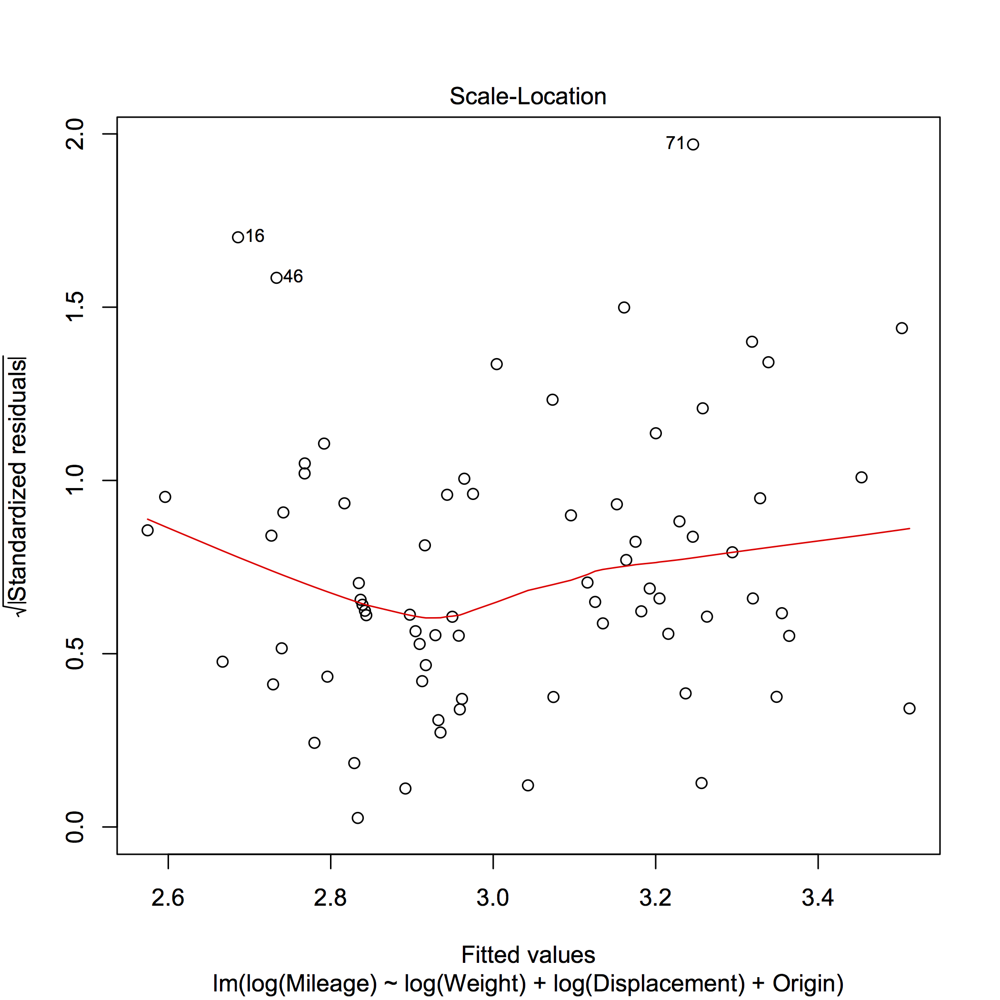
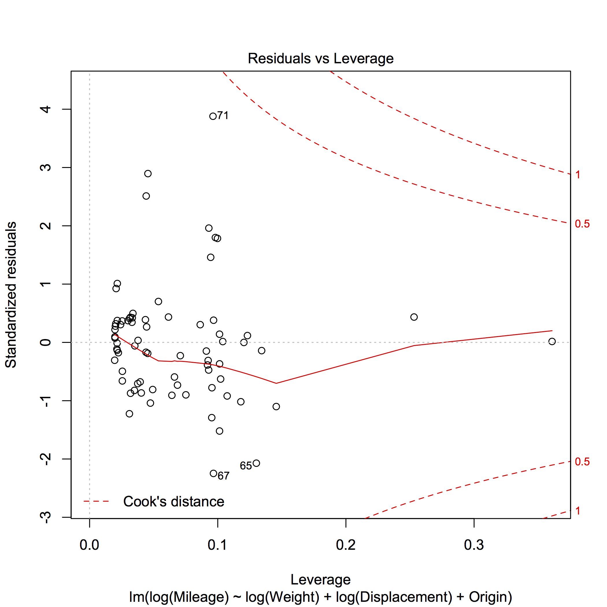

[](http://quantlet.de/index.php?p=info)

## [](http://quantlet.de/) **SMSlinregcar** [](http://quantlet.de/d3/ia)


```yaml
Name of Quantlet: SMSlinregcar

Published in: Multivariate Statistics: Exercises and Solutions Series 

Description: 'Computes a linear regression of mileage on weight and displacement for car data set'

Keywords: 'linear model, linear regression, least squares, R-squared, summary, F test, F-statistic, F-test, lm'

See also: 'SMSlassocar, SMSlassologit, SMSlinregcar, SMSlinregcar2, SMSlogitbankrupt'

Author[r]:   Zdenek Hlavka
Author[m]:   Janek Berger

Datafile[r]: carc.rda
Datafile[m]: carc.txt

Output: 'linear regression of mileage on weight and displacement for car data set'

Example[r]: '  reasonable model...
  summary(lm1<-lm(log(Mileage)~log(Weight)+log(Displacement)+Origin))

 Call:
 lm(formula = log(Mileage) ~ log(Weight) + log(Displacement) + 
     Origin)

 Residuals:
      Min       1Q   Median       3Q      Max 
 -0.27077 -0.08380 -0.00444  0.04649  0.46751 

 Coefficients:
                   Estimate Std. Error t value Pr(>|t|)    
 (Intercept)       10.21060    0.74575  13.692  < 2e-16 ***
 log(Weight)       -0.85981    0.13390  -6.421 1.46e-08 ***
 log(Displacement) -0.05688    0.08032  -0.708   0.4812    
 OriginJapan       -0.07518    0.05087  -1.478   0.1440    
 OriginEurope      -0.15620    0.05038  -3.100   0.0028 ** 
 ---
 Signif. codes:  0 ‘***’ 0.001 ‘**’ 0.01 ‘*’ 0.05 ‘.’ 0.1 ‘ ’ 1

 Residual standard error: 0.1268 on 69 degrees of freedom
 Multiple R-squared:  0.7756,	Adjusted R-squared:  0.7626 
 F-statistic: 59.62 on 4 and 69 DF,  p-value: < 2.2e-16


 Analysis of Variance Table

 Model 1: log(Mileage) ~ log(Weight) + log(Displacement) + Origin
 Model 2: log(Mileage) ~ log(Weight) + log(Displacement)
   Res.Df    RSS Df Sum of Sq      F  Pr(>F)  
 1     69 1.1089                              
 2     71 1.2638 -2  -0.15494 4.8207 0.01097 *
 ---
 Signif. codes:  0 ‘***’ 0.001 ‘**’ 0.01 ‘*’ 0.05 ‘.’ 0.1 ‘ ’ 1


  the outlier:
 carc[71,]
                  Mileage Weight Displacement Origin Price
 VW_Rabbit_Diesel      41   2040           90 Europe  5397


 summary(lm3<-lm(log(Mileage)~log(Weight)+Origin))

 Call:
 lm(formula = log(Mileage) ~ log(Weight) + Origin)

 Residuals:
      Min       1Q   Median       3Q      Max 
 -0.27642 -0.08388 -0.01317  0.04856  0.46870 

 Coefficients:
              Estimate Std. Error t value Pr(>|t|)    
 (Intercept)  10.56123    0.55568  19.006  < 2e-16 ***
 log(Weight)  -0.94108    0.06875 -13.688  < 2e-16 ***
 OriginJapan  -0.06591    0.04898  -1.346  0.18278    
 OriginEurope -0.14469    0.04752  -3.045  0.00328 ** 
 ---
 Signif. codes:  0 ‘***’ 0.001 ‘**’ 0.01 ‘*’ 0.05 ‘.’ 0.1 ‘ ’ 1

 Residual standard error: 0.1263 on 70 degrees of freedom
 Multiple R-squared:  0.774,	Adjusted R-squared:  0.7643 
 F-statistic: 79.89 on 3 and 70 DF,  p-value: < 2.2e-16'

Example[m]: 'a =

   Columns 1 through 5

     'Source'     'd.f.'    'Sum Sq'    'Mean Sq'    'F'
     'origin'     [   2]    [0.1487]    [ 0.0744]    [  4.6597]
     'X Value'    [   1]    [2.9897]    [ 2.9897]    [187.3642]
     'Error'      [  70]    [1.1170]    [ 0.0160]            []

   Column 6

     'Prob>F'
     [    0.0126]
     [1.7939e-21]
               []


 c =

     'Term'         'Estimate'    'Std. Err.'    'T'           'Prob>|T|'
     'Intercept'    [ 10.4910]    [   0.5398]    [ 19.4338]    [6.4343e-30]
     '  1'          [  0.0702]    [   0.0267]    [  2.6316]    [    0.0104]
     '  2'          [  0.0043]    [   0.0305]    [  0.1408]    [    0.8885]
     '  3'          [ -0.0745]    [   0.0297]    [ -2.5084]    [    0.0144]
     'Slope'        [ -0.9411]    [   0.0688]    [-13.6881]    [1.7939e-21]


 s =

         source: 'aoctool'
         gnames: {3x1 cell}
              n: [3x1 double]
             df: 70
              s: 0.1263
          model: 4
     intercepts: [3x1 double]
       intercov: [3x3 double]
            pmm: [3x1 double]
         pmmcov: [3x3 double]'

```








```R
# clear variables and close windows
rm(list=ls(all=TRUE))
graphics.off()

# load data
load("carc.rda")

carc=carc[,c("M","W","D","C","P")]
names(carc)=c("Mileage","Weight","Displacement","Origin","Price")

attach(carc)
opar=par(mfrow=c(2,2))
plot(log(Mileage)~log(Weight))
plot(log(Mileage)~log(Displacement))
plot(log(Mileage)~Origin)
plot(log(Displacement)~log(Weight))

# large displacement with small weight:
#> identify(log(Displacement)~log(Weight))
#[1] 10 17
#               Mileage Weight Displacement Origin Price
#Buick_Opel          26   2230          304     US  4453
#Chev._Chevette      29   2110          231     US  3299

# reasonable model...
summary(lm1<-lm(log(Mileage)~log(Weight)+log(Displacement)+Origin))
# model without origin
lm2<-lm(log(Mileage)~log(Weight)+log(Displacement))
# test whether origin is significant
anova(lm1,lm2)

#summary(lm3o<-lm(Mileage~(Weight+I(Weight^2)+Origin)^2))
#lm3<-lm(Mileage~(Weight+I(Weight^2)+Origin))
#anova(lm3,lm3o)
dev.new()

plot(lm1)

# the outlier:
carc[71,]
#                 Mileage Weight Displacement Origin Price
#VW_Rabbit_Diesel      41   2040           90 Europe  5397
# other suspicious observations:
# carc[c(16,46),]
#             Mileage Weight Displacement Origin Price
#Cad._Seville      21   4290          350     US 15906
#Olds._98          21   4060          350     US  8814

summary(lm3<-lm(log(Mileage)~log(Weight)+Origin))

## interaction is not significant
#summary(lm3.int<-lm(log(Mileage)~(log(Weight)+Origin)^2))
#anova(lm3,lm3.int)
dev.new()
par(mfrow=c(1,1))
plot(log(Mileage)~log(Weight),pch=as.numeric(Origin)-(Origin=="US")-2*(Origin=="Europe"),col=as.numeric(Origin)+1)
oo=order(carc$Weight)
c3=coef(lm3)
abline(c(c3[1],c3[2]),col=2) # US
abline(c(c3[1]+c3[3],c3[2]),col=3,lty=2) # Japan
abline(c(c3[1]+c3[4],c3[2]),col=4,lty=3) # Europe

par(opar)
detach(carc)

```
