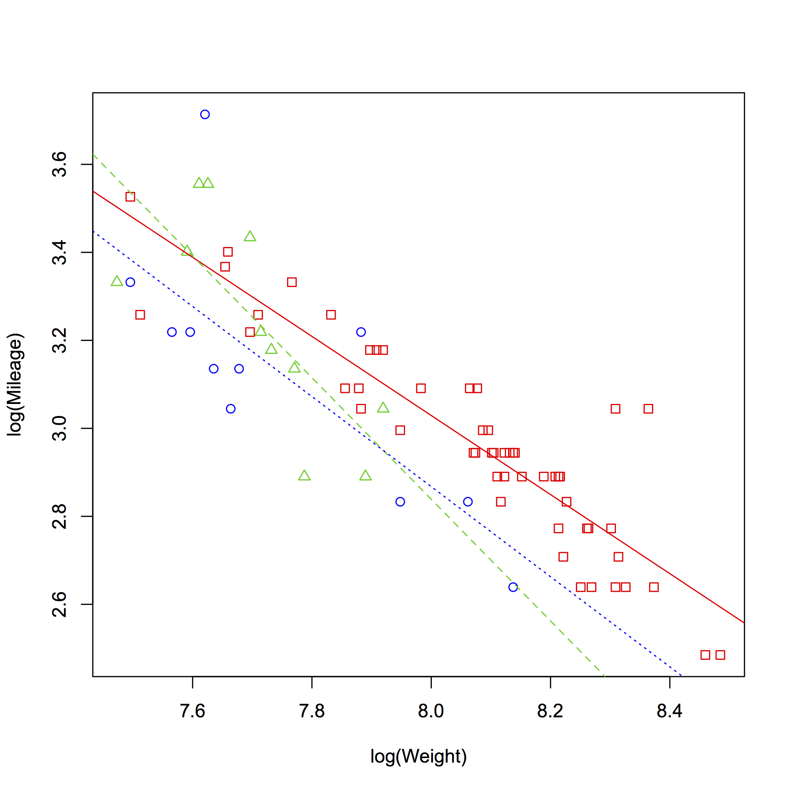

[](http://quantlet.de/index.php?p=info)

## [](http://quantlet.de/) **SMSlinregcar2** [](http://quantlet.de/d3/ia)


```yaml
Name of Quantlet: SMSlinregcar2

Published in: Multivariate Statistics: Exercises and Solutions Series 

Description: 'Computes a linear regression of mileage on weight and displacement for car data set '

Keywords: 'linear model, linear regression, least squares, R-squared, summary, F test, F-statistic, F-test, lm'

See also: 'SMSlassocar, SMSlassologit, SMSlassoridge, SMSlinregcar, SMSlinregcar2, SMSlogitbankrupt'

Author[r]:   Zdenek Hlavka
Author[m]:   Awdesch Melzer

Datafile[r]: carc.rda
Datafile[m]: carc.txt

Example[r]: 'linear model with origin
 summary(lm3<-lm(log(Mileage)~log(Weight)+Origin))

  Call:
 lm(formula = log(Mileage) ~ log(Weight) + Origin)

 Residuals:
      Min       1Q   Median       3Q      Max 
 -0.27642 -0.08388 -0.01317  0.04856  0.46870 

 Coefficients:
              Estimate Std. Error t value Pr(>|t|)    
 (Intercept)  10.56123    0.55568  19.006  < 2e-16 ***
 log(Weight)  -0.94108    0.06875 -13.688  < 2e-16 ***
 OriginJapan  -0.06591    0.04898  -1.346  0.18278    
 OriginEurope -0.14469    0.04752  -3.045  0.00328 ** 
 ---
 Signif. codes:  0 ‘***’ 0.001 ‘**’ 0.01 ‘*’ 0.05 ‘.’ 0.1 ‘ ’ 1

 Residual standard error: 0.1263 on 70 degrees of freedom
 Multiple R-squared:  0.774,    Adjusted R-squared:  0.7643 
 F-statistic: 79.89 on 3 and 70 DF,  p-value: < 2.2e-16
 

 summary(lm3.int<-lm(log(Mileage)~(log(Weight)+Origin)^2))

 Call:
 lm(formula = log(Mileage) ~ (log(Weight) + Origin)^2)

 Residuals:
      Min       1Q   Median       3Q      Max 
 -0.24228 -0.08267 -0.01660  0.05127  0.45775 

 Coefficients:
                          Estimate Std. Error t value Pr(>|t|)    
 (Intercept)              10.21992    0.61465  16.627   <2e-16 ***
 log(Weight)              -0.89883    0.07606 -11.818   <2e-16 ***
 OriginJapan               3.67677    2.40542   1.529    0.131    
 OriginEurope              0.83818    1.55118   0.540    0.591    
 log(Weight):OriginJapan  -0.48341    0.31103  -1.554    0.125    
 log(Weight):OriginEurope -0.12500    0.19876  -0.629    0.532    
 ---
 Signif. codes:  0 ‘***’ 0.001 ‘**’ 0.01 ‘*’ 0.05 ‘.’ 0.1 ‘ ’ 1

 Residual standard error: 0.1257 on 68 degrees of freedom
 Multiple R-squared:  0.7824,   Adjusted R-squared:  0.7664 
 F-statistic: 48.91 on 5 and 68 DF,  p-value: < 2.2e-16


 anova(lm3,lm3.int)

 Analysis of Variance Table

 Model 1: log(Mileage) ~ log(Weight) + Origin
 Model 2: log(Mileage) ~ (log(Weight) + Origin)^2
   Res.Df   RSS Df Sum of Sq      F Pr(>F)
 1     70 1.117                           
 2     68 1.075  2  0.041917 1.3257 0.2724'

Example[m]: ' lm3 = 
 
 
 Linear regression model:
     y ~ 1 + x1 + x2
 
 Estimated Coefficients:
                    Estimate    SE          tStat      pValue    
     (Intercept)      10.658     0.53695     19.849     1.085e-30
     x1             -0.94407    0.064924    -14.541    5.5883e-23
     x2             -0.07195    0.023431    -3.0708     0.0030248
 
 
 Number of observations: 74, Error degrees of freedom: 71
 Root Mean Squared Error: 0.125
 R-squared: 0.774,  Adjusted R-Squared 0.768
 F-statistic vs. constant model: 122, p-value = 1.2e-23


 
 lm3int = 
 
 
 Generalized Linear regression model:
     y ~ 1 + x1*x2
     Distribution = Normal
 
 Estimated Coefficients:
                    Estimate    SE          tStat      pValue    
     (Intercept)       10.22     0.61465     16.627    1.1828e-25
     x1             -0.89883    0.076055    -11.818    3.8193e-18
     x1:x2_2        -0.48341     0.31103    -1.5542       0.12477
     x1:x2_3          -0.125     0.19876    -0.6289       0.53152
     x2_2             3.6768      2.4054     1.5285       0.13102
     x2_3            0.83818      1.5512    0.54035       0.59072
 
 
 74 observations, 68 error degrees of freedom
 Estimated Dispersion: 0.0158
 F-statistic vs. constant model: 48.9, p-value = 3.31e-21'

```





```R
 # clear variables and close windows
rm(list=ls(all=TRUE))
graphics.off()

# setwd(C:/...) # set working directory
 # load data
load("carc.rda")

carc=carc[,c("M","W","D","C","P")]
names(carc)=c("Mileage","Weight","Displacement","Origin","Price")

attach(carc)
 # linear model with origin
summary(lm3<-lm(log(Mileage)~log(Weight)+Origin))

 # interaction is not significant
summary(lm3.int<-lm(log(Mileage)~(log(Weight)+Origin)^2))
anova(lm3,lm3.int)

par(mfrow=c(1,1))
plot(log(Mileage)~log(Weight),pch=as.numeric(Origin)-(Origin=="US")-2*(Origin=="Europe"),col=as.numeric(Origin)+1)
oo=order(carc$Weight)
c3=coef(lm3.int)
abline(c(c3[1],c3[2]),col=2) # US
abline(c(c3[1]+c3[3],c3[2]+c3[5]),col=3,lty=2) # Japan
abline(c(c3[1]+c3[4],c3[2]+c3[6]),col=4,lty=3) # Europe

detach(carc)

```
