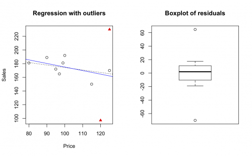

[](http://quantlet.de/index.php?p=info)

## [](http://quantlet.de/) **SMSlinregpull** [](http://quantlet.de/d3/ia)


```yaml

Name of Quantlet: SMSlinregpull

Published in: Multivariate Statistics: Exercises and Solutions

Description: 'Computes a linear regression of sales (X1) 
on price (X2) from the pullovers data set 
(pullover.rda). It checks for outliers using a rule on
standardized residuals and computes the same model for
the subset of the pullover data without outliers. Both
regression lines are plotted in the same scatterplot,
the outliers are marked as red triangles.'

Keywords: 'linear, linear model, linear regression, least-squares, R-squared,regression, F test, F-statistic, F-test, test, summary, statistics, boxplot, five number summary, plot, data visualization, graphical representation, visualization, scatterplot'

See also: 'SMSanovapull, SMSdete2pull, SMSdeterpull, SMSlinregpull, SMSscabank45, SMScovbank'

Author[r]: Zdenek Hlavka
Author[m]: Norman Duckwitz

Datafile[r]: pullover.rda
Datafile[m]: pullover.dat 

Output: 'Linear regression of sales (X1) on price (X2) from the pullovers data set.'

Example: ' Scatterplot of pullover data with a regression line with and without outliers, and a boxplot'

```





```R
# ---------------------------------------------------------------------
# Book:         SMS
# ---------------------------------------------------------------------
# Quantlet:     SMSlinregpull
# ---------------------------------------------------------------------
# Description:  It computes a linear regression of sales (X1) 
#               on price (X2) from the pullovers data set 
#               (pullover.rda). It checks for outliers using a rule on
#               standardized residuals and computes the same model for
#               the subset of the pullover data without outliers. Both
#               regression lines are plotted in the same scatterplot,
#               the outliers are marked as red triangles.
# ---------------------------------------------------------------------
# See also:     SMSanovapull, SMSdete2pull, SMSdeterpull, SMSlinregpull,
#               SMSscabank45, SMScovbank
# ---------------------------------------------------------------------
# Keywords:     linear, linear model, linear regression, least-squares, R-squared
#               regression, F test, F-statistic, F-test, test, summary,
#               statistics, boxplot, five number summary, plot,
#               data visualization, graphical representation,
#               visualization, scatterplot, 
# ---------------------------------------------------------------------
# Usage:        -
# ---------------------------------------------------------------------
# Inputs:       None
# ---------------------------------------------------------------------
# Output:       Linear regression of sales (X1) on price (X2) from the
#               pullovers data set (pullover.rda).
# ---------------------------------------------------------------------
# Example:      Scatterplot of pullover data with a regression line with
#               and without outliers, and a boxplot
# ---------------------------------------------------------------------
# Author:       Zdenek Hlavka
# ---------------------------------------------------------------------

# Clear all variables and close windows
 rm(list=ls(all=TRUE))
 graphics.off()

# setwd("C:/...") # please change your working directory

# install and load packages
libraries = c("MASS")
lapply(libraries, function(x) if (!(x %in% installed.packages())) {
  install.packages(x)
})
lapply(libraries, library, quietly = TRUE, character.only = TRUE)

load("pullover.rda")                       # load data

lm.pull = lm( Sales~Price,data=pullover)   # linear model, y=Sales, X=[Price] including intercept 
opar    = par(mfrow=c(1,2))                # define screen with 1 row and 2 columns
outlier = (abs(stdres(lm.pull))>2)         # check for outliers using a rule on standardized residuals from the regression model

# plot all data points and the regression line
plot(Sales~Price,   data=pullover, type="n",main="Regression with outliers")
points(Sales~Price, data=pullover, subset=!outlier)
points(Sales~Price, data=pullover, subset=outlier,col="red",pch=17)
abline(coef(lm.pull),lty=3)

# re-do the analysis without outliers
lm.pull.2 = lm(Sales~Price, data=pullover, subset=!outlier) # linear model, y=Sales, X=[Price], on subset without outliers
abline(coef(lm.pull.2),col="blue")

# boxplot of the original residuals
boxplot(lm.pull$residuals,main="Boxplot of residuals")
par(opar)

```
