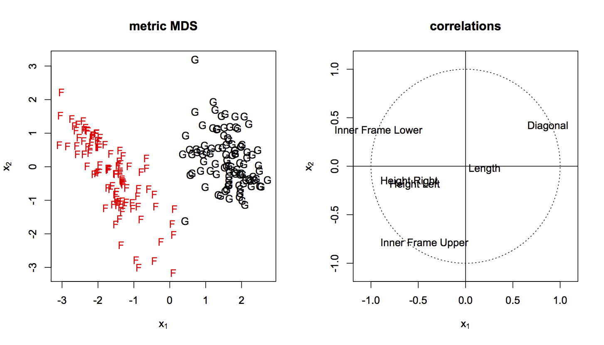

[](http://quantlet.de/index.php?p=info)

## [](http://quantlet.de/) **SMSmdsbank** [](http://quantlet.de/d3/ia)


```yaml
Name of Quantlet: SMSmdsbank

Published in: Multivariate Statistics: Exercises and Solutions

Description: 'Applies multidimensional scaling for Swiss bank notes. The Swiss bank note data is transformed into an Euclidean distance matrix of size (200 x 200). An attempt to achieve the original configuration of points is made employing metric MDS. Results are quite similar to configuration from PCA. The scatterplot of two-dimensional projections, however, gives better seperation. A reason could be that principal components are based only on the estimates of a covariance matrix which is wrong if the data set consists of more subgroups.'

Keywords: 'multidimensional scaling, mds, metric, distance, Euclidean, correlation'

See also: 'SMSmdsbank, SMSnmdsathlesub, SMSnmdsathletic, SMSnmdscarm, SMSnmdsuscrime, SMSnmdsushealth'

Author[r]: Zdenek Hlavka
Author[m]: Awdesch Melzer

Datafile[r]: bank2.rda
Datafile[m]: bank2.dat

Example: 'Plot of Metric MDS for Swiss bank notes and correlation of MDS with original variables'
```





```R
# clear variables and close windows
rm(list=ls(all=TRUE))
graphics.off()

# install and load packages
libraries = c("MASS")
lapply(libraries, function(x) if (!(x %in% installed.packages())) {
    install.packages(x)})
lapply(libraries, library, quietly = TRUE, character.only = TRUE)

# load data
load("bank2.rda")

# factor variable
counter = rep(c("G","F"),each=100)

# main calculation
sol     = cmdscale(dist(bank2))
corr    = cor(cbind(sol,bank2))[3:8,1:2]
corr    = t(t(corr[,1:2])*sign(corr[1,1]))
sol     = t(t(sol[,1:2])*sign(sol[1,1:2]))

# plot
opar    = par(mfrow=c(1,2))

# plot of coordinates
plot(sol,type="n",xlab=expression(x[1]),ylab=expression(x[2]),main="metric MDS")
text(sol,counter,col=rep(1:2,each=100))

# plot of correlations of mds with original variables
plot(c(-1.1,1.1),c(-1.1,1.1),type="n",main="correlations",xlab=expression(x[1]),ylab=expression(x[2]))
ucircle = cbind(cos((0:360)/180*3.14159),sin((0:360)/180*3.14159))
points(ucircle,type="l",lty="dotted")
abline(h = 0)
abline(v = 0)
text(corr,labels=colnames(bank2),col="black",xpd=NA)

par(opar)

```
