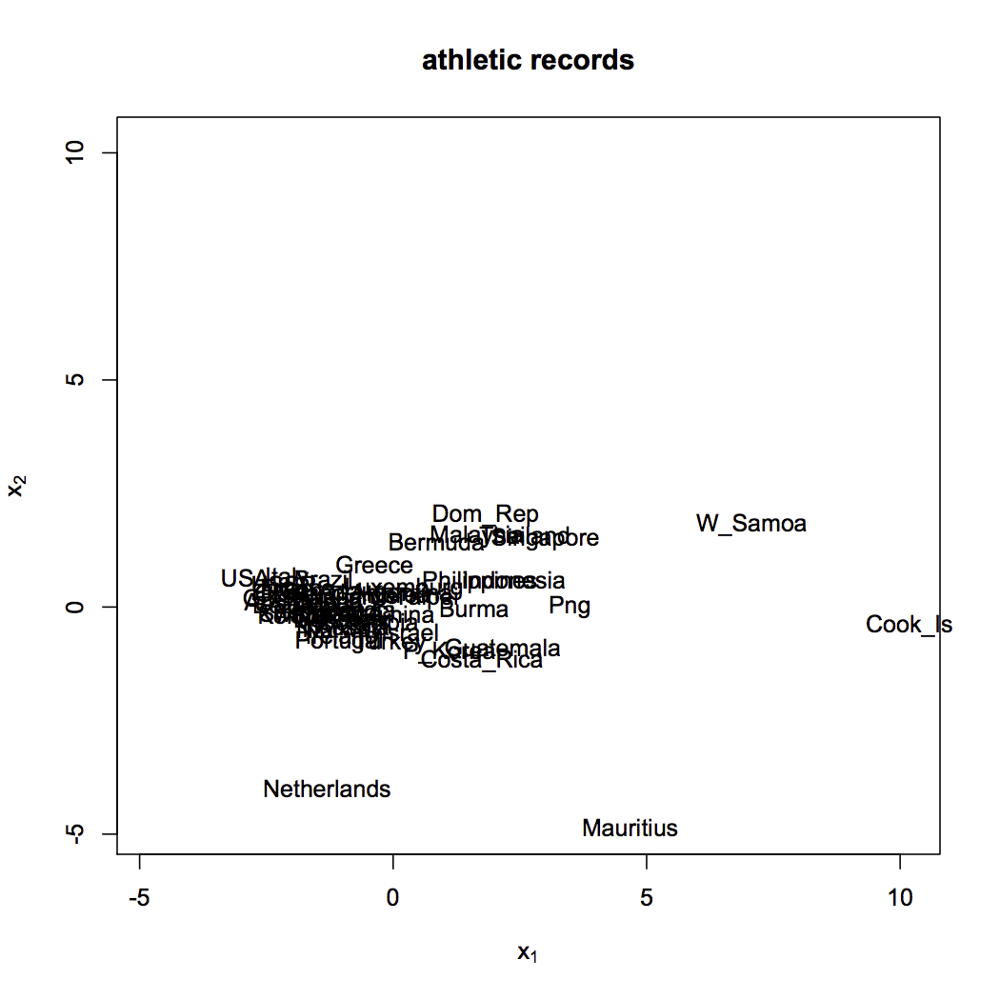

[](http://quantlet.de/index.php?p=info)

## [](http://quantlet.de/) **SMSnmdsathletic** [](http://quantlet.de/d3/ia)


```yaml
Name of Quantlet: SMSnmdsathletic

Published in: Multivariate Statistics: Exercises and Solutions

Description: 'computes the nonmetric MDS for the athletic data set. Performing the nonmetric MDS we observe a cloud containing most of the countries and at some distance Netherlands, Mauritius, West Samoa, Cook Islands.'

Keywords: 'multidimensional scaling, mds, nonmetric, distance, Euclidean, correlation'

See also: 'SMSmdsbank, SMSnmdsathlesub, SMSnmdsathletic, SMSnmdscarm, SMSnmdsuscrime, SMSnmdsushealth'

Author[r]: Radka Pickova, Zdenek Hlavka
Author[m]: Awdesch Melzer

Datafile[r]: athletic.rda
Datafile[m]: athletic.mat

Example: 'Nonmetric MDS for the athletic data set'
```





```R
# clear variables and close windows
rm(list=ls(all=TRUE))
graphics.off()

# install and load packages
libraries = c("MASS")
lapply(libraries, function(x) if (!(x %in% installed.packages())) {
    install.packages(x)})
lapply(libraries, library, quietly = TRUE, character.only = TRUE)

# setwd("C:/...") # please set the working directory
# load data
load("athletic.rda")

# compute distance
athletic.dist = dist(scale(athletic))

# nonmetric MDS
athletic.mds = isoMDS(athletic.dist,maxit=1000,tol = 1e-6)
xylim        = range(athletic.mds$points[,1],-athletic.mds$points[,2])

# plot
plot(athletic.mds$points[,1],-athletic.mds$points[,2], main="athletic records", type = "n", ylab=expression(x[2]), xlab=expression(x[1]),xlim=xylim,ylim=xylim)
text(athletic.mds$points[,1],-athletic.mds$points[,2], labels = row.names(athletic),xpd=NA)
```
