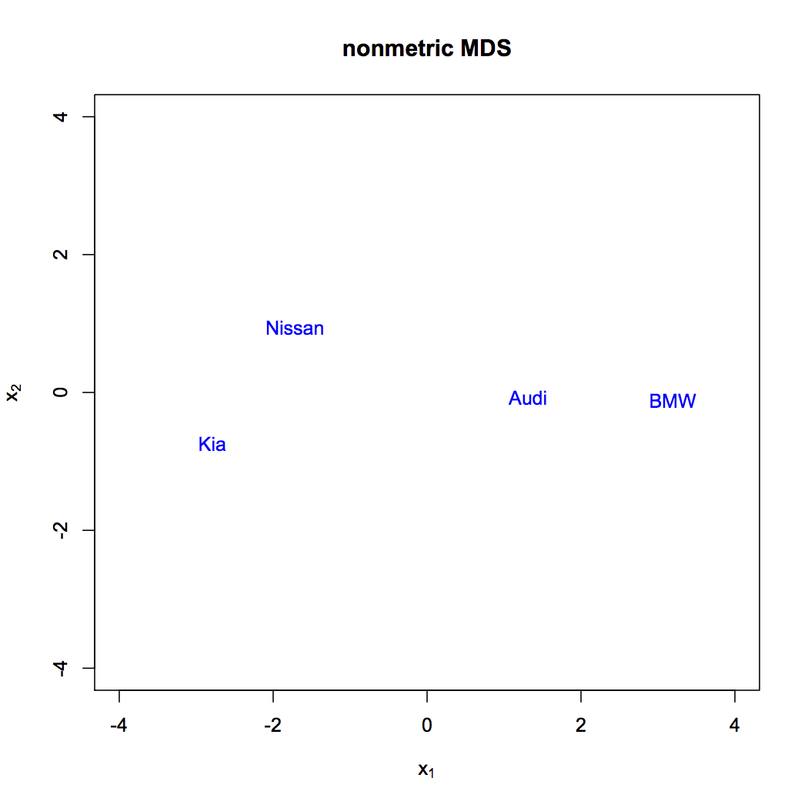

[](http://quantlet.de/index.php?p=info)

## [](http://quantlet.de/) **SMSnmdscarm** [](http://quantlet.de/d3/ia)


```yaml
Name of Quantlet: SMSnmdscarm

Published in: Multivariate Statistics: Exercises and Solutions

Description: 'Computes the 2D map of 4 cars based on ranks of differences using nonmetric multidimensional scaling. nMDS assumes dissimilarities being monotone function of the Euclidean distances and uses the iterative Shepard-Kruskal algorithm to find a configuration of points in 2D that satisfies this monotonicity.'

Keywords: 'multidimensional scaling, mds, nonmetric, distance, Euclidean, correlation'

See also: 'SMSmdsbank, SMSnmdsathlesub, SMSnmdsathletic, SMSnmdscarm, SMSnmdsuscrime, SMSnmdsushealth'

Author[r]: Petra Cernayova, Zdenek Hlavka
Author[m]: Awdesch Melzer

Example: '2D map of 4 cars based on ranks of differences using nonmetric multidimensional scaling'
```





```R
# clear variables and close windows
rm(list=ls(all=TRUE))
graphics.off()

# install and load packages
libraries = c("MASS")
lapply(libraries, function(x) if (!(x %in% installed.packages())) {
    install.packages(x)})
lapply(libraries, library, quietly = TRUE, character.only = TRUE)

# variables
desc = c("Nissan","Kia","BMW","Audi")
#D = cbind(c(0,2,4,3),c(2,0,6,5),c(4,6,0,1),c(3,5,1,0))
D = cbind(c(0,2,5,3),c(2,0,6,4),c(5,6,0,1),c(3,4,1,0))
D

# main calculation
b = isoMDS(D, k = 2, maxit = 1000,tol=1e-10)

# 2D map
plot(b$points,xlab=expression(x[1]),ylab=expression(x[2]),xlim=c(-4,4),ylim=c(-4,4),main="nonmetric MDS",type="n")
text(b$points,desc,col="blue")

dist(b$points)
```
