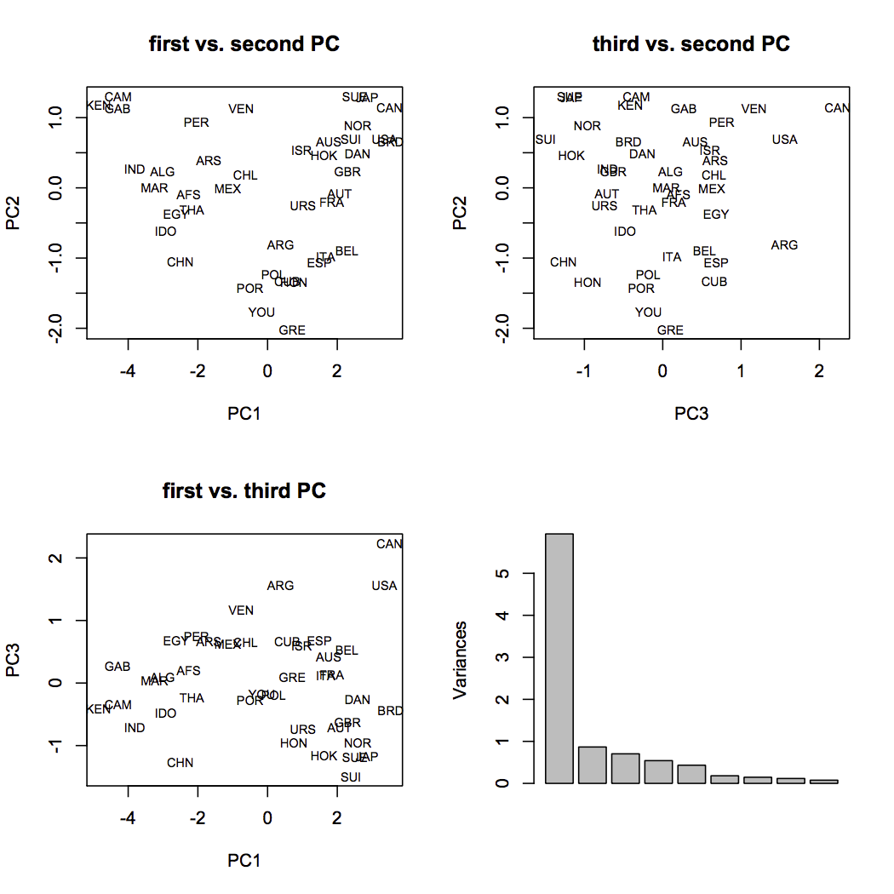
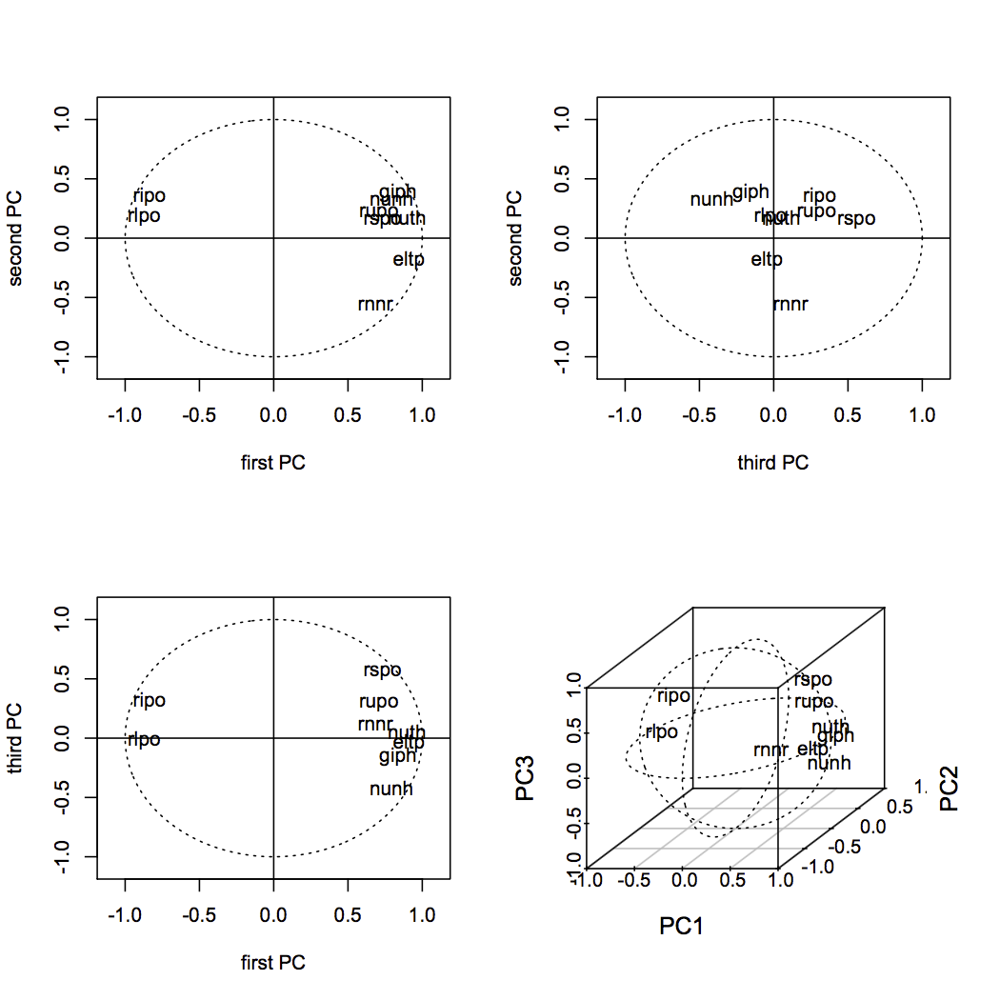

[](http://quantlet.de/index.php?p=info)

## [](http://quantlet.de/) **SMSnpcageopol** [](http://quantlet.de/d3/ia)


```yaml
Name of Quantlet: SMSnpcageopol

Published in: Multivariate Statistics: Exercises and Solutions

Description: 'Performes a normalized principal component analysis NPCA on the Geopol data set, which contains a comparison of 41 countries according to 10 political and economic parameters. The NPCA is computed without the first variable, size of population. The remaining variables are: gross internal product per habitant (giph), rate of increase of the population (ripo), rate of urban population (rupo), rate of illiteracy (rlpo), rate of students (rspo), expected lifetime (eltp), rate of nutritional needs realized (rnnr), number of newspaper and magazines per 1000 habitants (nunh), and number of televisions per 1000 habitants (nuth). Since variables measured on different scales they have to be normalized in order to produce trustworthy results. Scatterplots of ther first three principal components, a screeplot and correlation plots of the first three PCs with the original variables are produced.'

Keywords: 'NPCA, dimension reduction, eigenvalues, eigenvectors, multi-dimensional, multivariate, normalization, pca, principal-components, scaling, screeplot, transformation'

See also: 'SMSnpcasimu, SMSnpcasimu, SMSnpcathletic, SMSnpcathletic, SMSpcacarm, SMSpcacarm, SMSpcahealth, SMSpcahealth'

Author[r]: Zdenek Hlavka
Author[m]: Awdesch Melzer

Datafile[r]: geopol.rda
Datafile[m]: geopol.dat

Output: 'Scatterplots of ther first three principal components, a screeplot and correlation plots of the first three PCs with the original variables are produced.'

Example: 'Visualization of variables and individuals after dimension reduction. Screeplot'
```






```R
# clear cache and close windows
 rm(list=ls(all=TRUE))
 graphics.off()

# setwd("C:/...") # set working directory
load("geopol.rda")

pcgeopol=prcomp(~giph+ripo+rupo+rlpo+rspo+eltp+rnnr+nunh+nuth,scale.=TRUE,data=geopol)
print(pcgeopol)

## eigenvalues of the variance matrix are pcgeopol$sdev^2

opar=par(mfrow=c(2,2))
plot(pcgeopol$x[,c(1,2)],type="n",main="first vs. second PC")
text(pcgeopol$x[,c(1,2)],row.names(geopol),cex=0.7,xpd=NA)
plot(pcgeopol$x[,c(3,2)],type="n",main="third vs. second PC")
text(pcgeopol$x[,c(3,2)],row.names(geopol),cex=0.7,xpd=NA)
plot(pcgeopol$x[,c(1,3)],type="n",main="first vs. third PC")
text(pcgeopol$x[,c(1,3)],row.names(geopol),cex=0.7,xpd=NA)
plot(pcgeopol,main="")
dev.new()
par(mfrow=c(2,2))

plot(c(-1.1,1.1),c(-1.1,1.1),type="n",main="",xlab="first PC",ylab="second PC")
ucircle<-cbind(cos((0:360)/180*3.14159),sin((0:360)/180*3.14159))
points(ucircle,type="l",lty="dotted")
abline(h = 0)
abline(v = 0)
cors=pcgeopol$rotation%*%diag(pcgeopol$sdev)
lab=colnames(geopol)[2:10]
text(cors[,c(1,2)],labels=lab,col="black")

plot(c(-1.1,1.1),c(-1.1,1.1),type="n",main="",xlab="third PC",ylab="second PC")
points(ucircle,type="l",lty="dotted")
abline(h = 0)
abline(v = 0)
text(cors[,c(3,2)],labels=lab,col="black")

plot(c(-1.1,1.1),c(-1.1,1.1),type="n",main="",xlab="first PC",ylab="third PC")
points(ucircle,type="l",lty="dotted")
abline(h = 0)
abline(v = 0)
text(cors[,c(1,3)],labels=lab,col="black")

library(scatterplot3d)
colnames(cors)=paste("PC",1:9,sep="")
a=scatterplot3d(rbind(c(-1,-1,-1),c(1,1,1)),type="n",xlab="PC1",ylab="PC2",zlab="PC3")
text(a$xyz.convert(cors[,1:3]),lab)
lines(a$xyz.convert(cbind(ucircle,0)),lty="dotted")
lines(a$xyz.convert(cbind(0,ucircle)),lty="dotted")
lines(a$xyz.convert(cbind(ucircle[,1],0,ucircle[,2])),lty="dotted")

par(opar)


```
