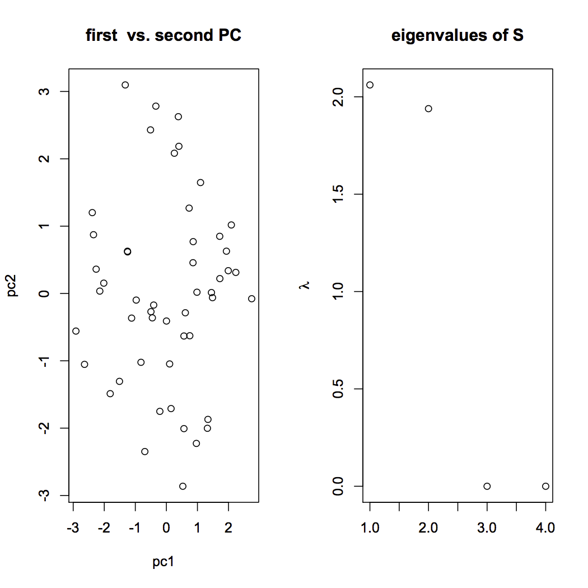
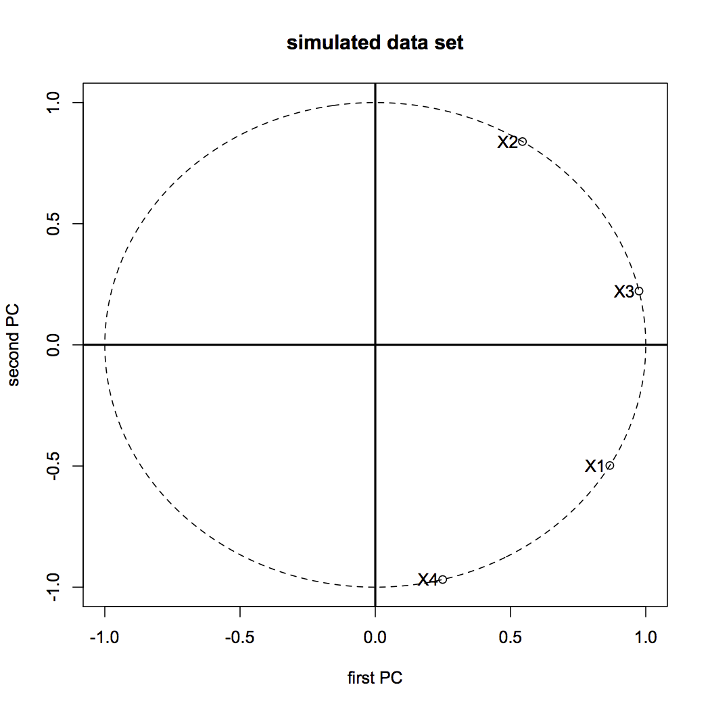

[](http://quantlet.de/index.php?p=info)

## [](http://quantlet.de/) **SMSnpcasimu** [](http://quantlet.de/d3/ia)


```yaml
Name of Quantlet: SMSnpcasimu

Published in: Multivariate Statistics: Exercises and Solutions

Description: 'Simulates a multivariate sample of size n=50 and performes a normalized principal component analysis (NPCA). Eigenvalues, eigenvectors, screeplot, the first two PCs and the correlation of the first two PCs with the original variables are shown as results.'

Keywords: 'NPCA, dimension reduction, multi-dimensional, multivariate, normalization, pca, principal-components, random, random-number-generation, scaling, screeplot, simulation, transformation, uniform'

See also: 'SMSnpcacrime, SMSnpcageopol, SMSnpcasimu, SMSnpcathletic, SMSpcacarm, SMSpcahealth'

Author[r]: Alena Babiakova
Author[m]: Awdesch Melzer

Output: 'Eigenvalues, eigenvectors, screeplot, the first two principal components and the correlation of the first two PCs with the original variables are shown as results.'

Example: 'Visualization of variables and individuals after dimension reduction. Screeplot'
```






```R
# clear cache and close windows
rm(list=ls(all=TRUE))
graphics.off()

# fix pseudo random numbers
set.seed(1)

u   = matrix(runif(100), ncol = 2);
a   = cbind(c(1,0), c(0,1), c(1,1), c(1, -1));
x   = u %*% a;                     # generate the random data set
x   = scale(x);
n   = nrow(x);
tmp = eigen(cov(x), symmetric = TRUE);
e   = tmp$values;
v   = tmp$vectors;                 # spectral analysis
tmp = cbind(e,t(v))[order(-e),];
e   = tmp[,1];
v   = t(tmp[,2:5]);

print("eigenvalues and proportions of explained variance");
print(t(cbind(e,(e/sum(e)),(cumsum(e)/sum(e)))));
print("2 eigenvectors")
print(t(v[,1:2]));

y   = x %*% v;                     # principal components
x12 = y[,1:2];

op = par(mfrow = c(1,2));
plot(x12, main = "first  vs. second PC", xlab = "pc1", ylab = "pc2");
plot(cbind(c(1:4),e), main = "eigenvalues of S", xlab = "", ylab = expression(lambda));
# screeplot of eigenvalues
par(mfrow = c(1,1),ask = dev.interactive(orNone = TRUE))
r = cor(cbind(y,x));
r = r[5:8,1:2];                  # correlations between variables and pc's
ucircle = cbind(cos((0:360)/180*3.14159),sin((0:360)/180*3.14159));
xline = cbind(c(-1.1,1.1),c(0,0));
yline = cbind(c(0,0),c(-1.1,1.1));
dev.new()
plot(ucircle, type = "n", main = "simulated data set", xlab = "first PC", ylab = "second PC");
lines(ucircle, lty = "dashed");
lines(xline, lwd = 2);
lines(yline, lwd = 2);
points(r);
text(r, c("X1","X2","X3","X4"), adj = 1.2);
par(op);

```
