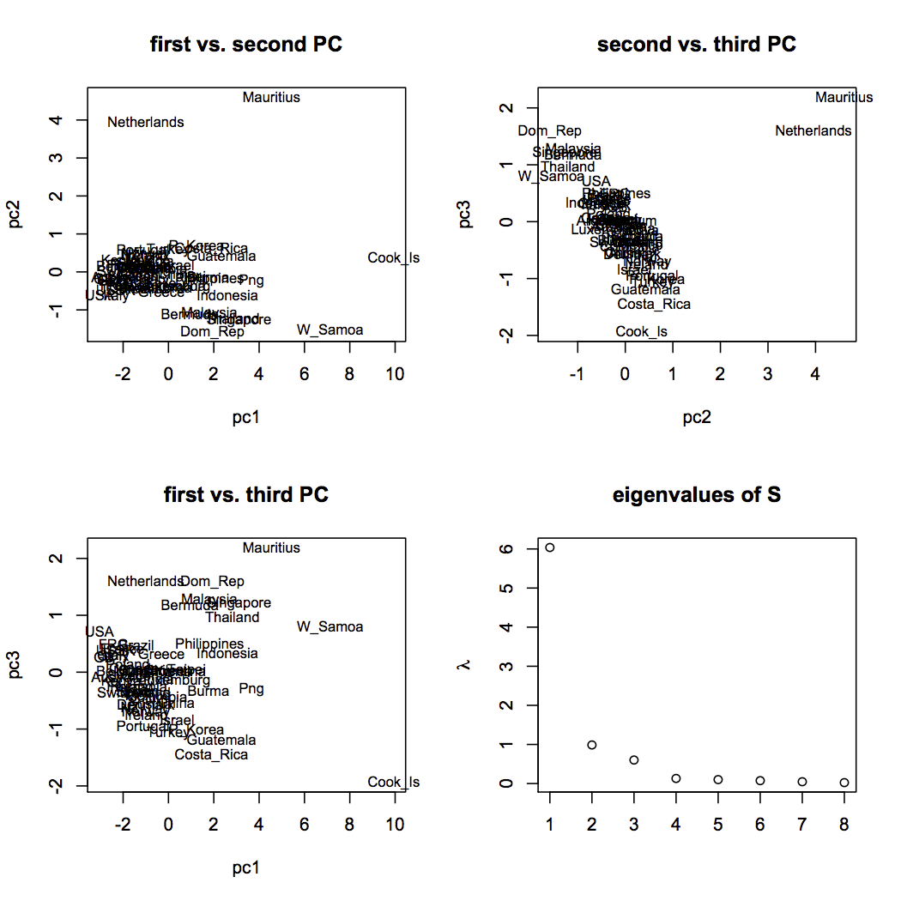
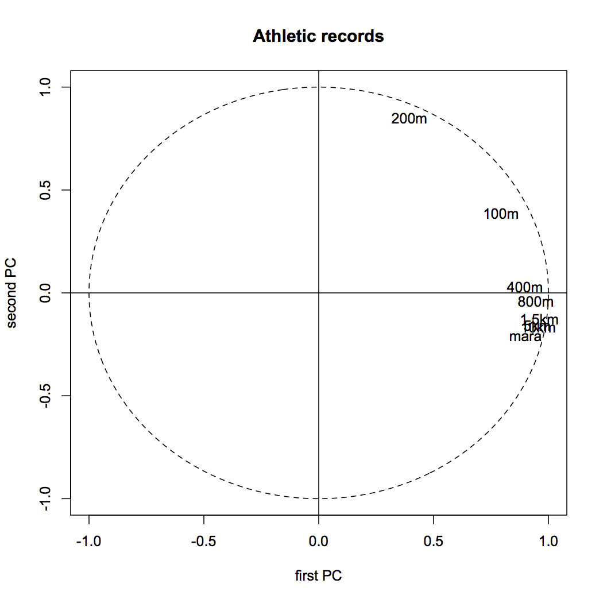

[](http://quantlet.de/index.php?p=info)

## [](http://quantlet.de/) **SMSnpcathletic** [](http://quantlet.de/d3/ia)


```yaml
Name of Quantlet: SMSnpcathletic

Published in: Multivariate Statistics: Exercises and Solutions

Description: ‘Performs a normalized principal component
              analysis for the athletic data set (athletic.mat) which
              contains national athletic records of 55 countries in eight
              disciplines (100m, 200m, 400m, 800m, 1500m, 5km, 10km and
              marathon). Evidently, for different length of tracks
              different times were measured. Thus, the data is normalized
              before running the PC analysis. Eigenvalues, eigenvectors, 
              screeplot, the first three principal components (PCs) and
              the correlation of the first two PCs with the original
              variables are shown as results.'

Keywords: 'NPCA, dimension reduction, eigenvalues, eigenvectors, multi-dimensional, multivariate, normalization, pca, principal-components, scaling, screeplot, transformation'

See also: 'SMSnpcacrime, SMSnpcageopol, SMSnpcasimu, SMSnpcathletic, SMSpcacarm, SMSpcahealth'

Author[r]: Ondrej Sedivy
Author[m]: Awdesch Melzer

Datafile[r]: athletic.rda
Datafile[m]: athletic.mat

Output: 'Eigenvalues, eigenvectors, screeplot, the first three principal components and the correlation of the first two PCs with the original variables are shown as results.'

Example: 'Visualization of variables and individuals after dimension reduction. Screeplot'
```






```R
# clear workspace
 rm(list=ls(all=TRUE))
 graphics.off()

# install and load packages
libraries = c("MASS")
lapply(libraries, function(x) if (!(x %in% installed.packages())) {
  install.packages(x)
})
lapply(libraries, library, quietly = TRUE, character.only = TRUE)

# setwd("C:/...") # set working directory
# load data
load("athletic.rda")

mat = as.matrix(athletic)
for (i in 1:8) mat[,i] = (mat[,i]-mean(mat[,i]))/sqrt(var(mat[,i]))

pc = prcomp(mat)
pc1 = mat%*%pc$rotation[,1]
pc2 = mat%*%pc$rotation[,2]
pc3 = mat%*%pc$rotation[,3]

#op = par(mfrow = c(2,2),ask = dev.interactive(orNone = TRUE))
op = par(mfrow = c(2,2))
popisky = row.names(athletic)
plot(pc2~pc1, main="first vs. second PC", type="n")
text(pc1,pc2,popisky,xpd=NA,cex=0.8)
plot(pc3~pc2, main="second vs. third PC", type="n")
text(pc2,pc3,popisky,xpd=NA,cex=0.8)
plot(pc3~pc1, main="first vs. third PC", type="n")
text(pc1,pc3,popisky,xpd=NA,cex=0.8)
eig = eigen(cov(mat))
plot(eig$values, main = "eigenvalues of S",xlab="",ylab=expression(lambda))
par(op)

cov1 = pc$rotation%*%diag(pc$sdev)

dev.new()
par(mfrow = c(1,1))
#plot.window(xlim=c(-1,1),ylim=c(-1,1))
plot(cov1[,1],cov1[,2],xlab="first PC", ylab="second PC",xlim=c(-1,1),ylim=c(-1,1),main="Athletic records",type="n")
text(cov1[,1],cov1[,2],c("100m","200m","400m","800m","1,5km","5km","10km","mara"))
abline(h=0)
abline(v=0)
ucircle = cbind(cos((0:360)/180*3.14159),sin((0:360)/180*3.14159));
lines(ucircle, lty = "dashed");


print("eigenvalues")
print(eig$values)
print("1st eigenvector")
print(pc$rotation[,1])
print("2nd eigenvector")
print(pc$rotation[,2])
par(op)

```
