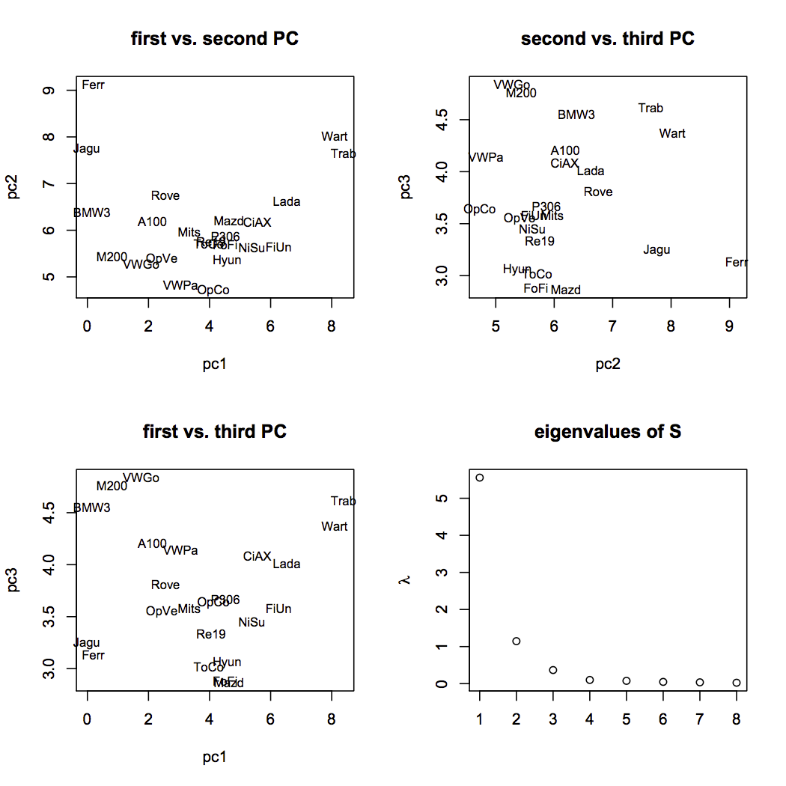
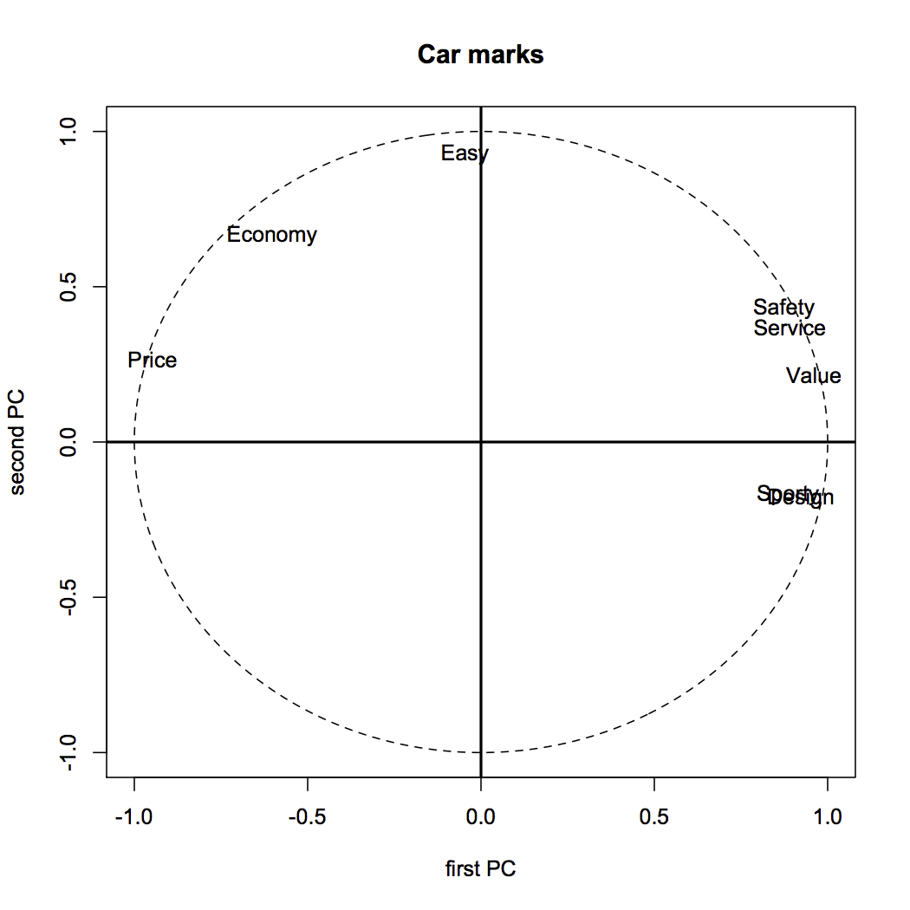

[](http://quantlet.de/index.php?p=info)

## [](http://quantlet.de/) **SMSpcacarm** [](http://quantlet.de/d3/ia)


```yaml
Name of Quantlet: SMSpcacarm

Published in: Multivariate Statistics: Exercises and Solutions

Description: 'pplies the PCA to the car marks data
               which contains marks of different car
               brands for different objectives, e.g. economy, service, value, 
               price, design, sporty, safety and handling (marks are assigned 
               as 1 = best, 6=worst). Eigenvalues of the covariance
               matrix, the proportion of explained variance are presented.
               Moreover first three principal components are plotted
               against each other, a screeplot is displayed and the
               correlations of the first two PCs with the original
               variables are shown. In addition the hypothesis that the
               proportion of variance explained by the first two PCs is
               85 percent is tested and rejected. Thus the proportion of
               explained variance by the first two PCs is larger than 85.'

Keywords: 'NPCA, PCA, principal components, scaling, transformation,
screeplot, random, simulation, uniform, random number
generation, normalization, multivariate, dimension
reduction, multi dimensional, Hypothesis Testing, test'

See also: 'SMSnpcacrime, SMSnpcageopol, SMSnpcasimu, SMSnpcathletic, SMSpcacarm, SMSpcahealth'

Author[r]: Michaela Marsalkova
Author[m]: Awdesch Melzer

Datafile[r]: carmean2.rda
Datafile[m]: carmean2.dat

Output: 'Eigenvalues, eigenvectors, screeplot, the first three principal
components and the correlation of the first two PCs with 
the original variables are shown as results. Moreover the
hypothesis of variance explained being equal to 85% is
tested.'

Example: 'Visualization of variables and individuals after dimension reduction. Screeplot'
```






```R
# Clear workspace
rm(list=ls(all=TRUE))
graphics.off()

# setwd("C:/...") # Please change your working directory corresponding to path of carmean2.rda

load("carmean2.rda")

x   = as.matrix(carmean2)
n   = length(x[,1])

t   = row.names(carmean2) #labels for plotting PCAs
t1  = names(carmean2)    #labels for plotting correlation

e   = eigen(cov(x))  

v   = -e$vectors  #eigenvectors
e   = e$values    #eigenvalues (sorted in decreasing order)

print("eigenvalues and proportions of explained variance")
print(rbind(e,(e/sum(e)),(cumsum(e)/sum(e))))

print("2 eigenvectors")
print(v[,1:2])

op  = par(no.readonly = TRUE)

par(mfrow=c(2,2))

y   = x%*%v   #primary components

 #plot first three primary components in pairs against each other
plot(y[,1],y[,2],main="first vs. second PC",xlab="pc1",ylab="pc2",type="n")
text(y[,1],y[,2],labels=t,adj=c(0.5,0.5),cex=0.8,xpd=NA)

plot(y[,2],y[,3],main="second vs. third PC",xlab="pc2",ylab="pc3",type="n")
text(y[,2],y[,3],labels=t,adj=c(0.5,0.5),cex=0.8,xpd=NA)

plot(y[,1],y[,3],main="first vs. third PC",xlab="pc1",ylab="pc3",type="n")
text(y[,1],y[,3],labels=t,adj=c(0.5,0.5),cex=0.8,xpd=NA)

plot(1:8,e,main="eigenvalues of S",xlab="",ylab=expression(lambda)) 

r   = cor(y[,1:2],x)  #correlation between first two components and data
dev.new()
par(mfrow=c(1,1))
plot(cos((0:360)/180*3.14159),sin((0:360)/180*3.14159),type="l",lty="dashed",main="Car marks", xlab="first PC",ylab="second PC")
text(r[1,],r[2,],labels=t1,adj=c(0.5,0.5),xpd=NA)
abline(v=0,lwd=2)
abline(h=0,lwd=2)

print("test psi2=0.85")
print("q=2")
beta = (cumsum(e^2)/sum(e^2))[2]
print("beta")
print(beta)
psi = (cumsum(e)/sum(e))[2]
omega2 = (2*sum(e^2)/((sum(e))^2))*(psi^2 - 2*beta*psi+beta)
print("omega2")
print(omega2)
print("test statistic")
print(sqrt(length(x[,1])-1)*(psi-0.85)/sqrt(omega2))

par(op)


```
