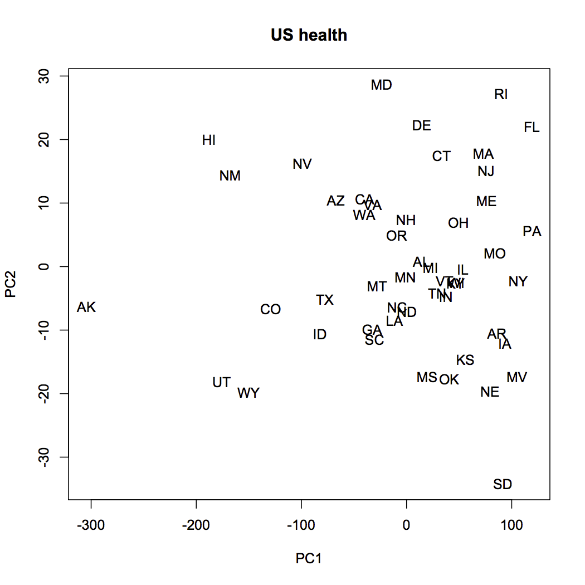
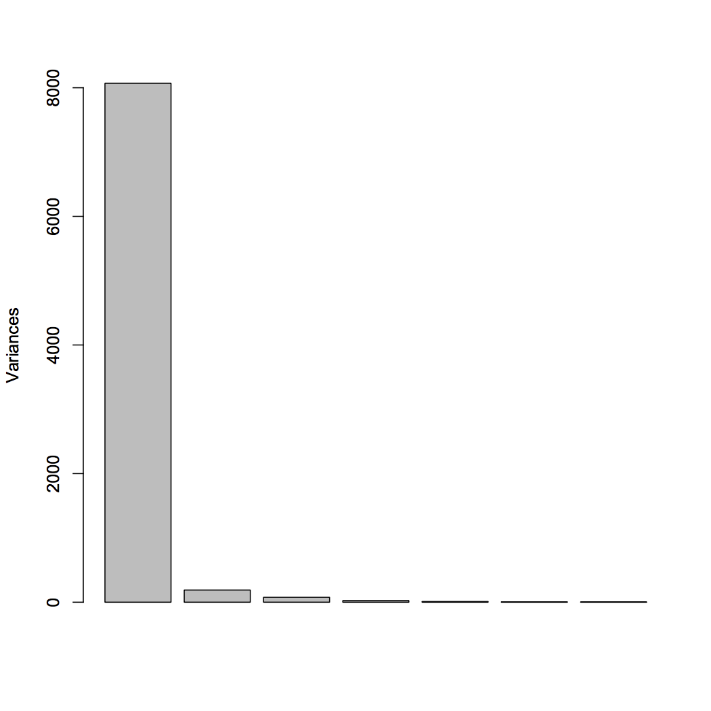
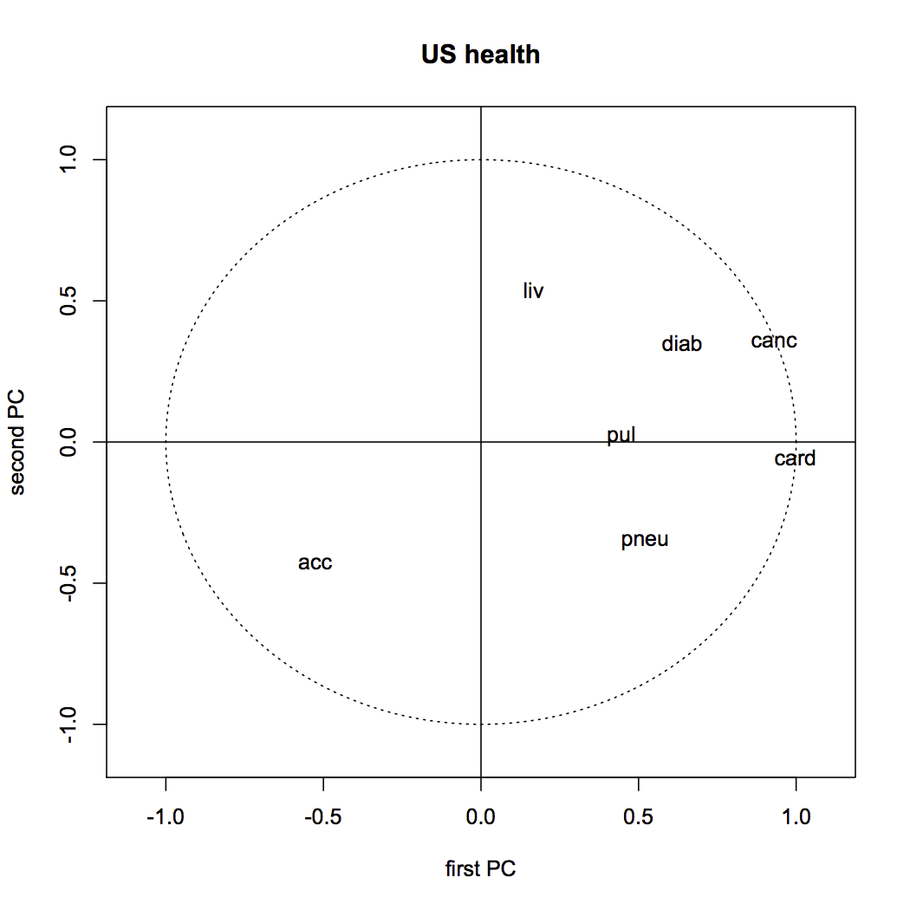

[](http://quantlet.de/index.php?p=info)

## [](http://quantlet.de/) **SMSpcahealth** [](http://quantlet.de/d3/ia)


```yaml
Name of Quantlet: SMSpcahealth

Published in: Multivariate Statistics: Exercises and Solutions

Description: 'Employs the principal component analysis to the 
               US health data set which contains reported numbers of deaths in
               the 50 U.S. states classified according to 7 categories: accident,
               cardiovascular, cancer, pulmonary, pneumonia flu, diabetes, and
               liver. Normalizing the data gives equal importance to each cause
               of death. Not normalizing however, leaves the most prominent role
               to the variables causing largest number of deaths. Correlations
               of the first two PCs with the original variables, the screeplot
               and a scatterplot of the first two principal components are
               are presented.'

Keywords: 'NPCA, dimension reduction, eigenvalues, eigenvectors, multi-dimensional, multivariate, normalization, pca, principal-components, scaling, screeplot, transformation'

See also: 'SMSnpcacrime, SMSnpcageopol, SMSnpcasimu, SMSnpcathletic, SMSpcacarm, SMSpcahealth'

Author[r]: Zdenek Hlavka
Author[m]: Awdesch Melzer

Datafile[r]: uscrime.rda
Datafile[m]: uscrime.dat

Output: 'Table of principal components and plots of normalized principal components for US crime data'

Example: 'Visualization of variables and individuals after dimension reduction. Screeplot'
```






```R
# clear workspace
 rm(list=ls(all=TRUE))
 graphics.off()

# setwd("C:/...") # Please change your working directory corresponding to path of carmean2.rda

load("ushealth.rda")

pchealth = prcomp(~ acc+card+canc+pul+pneu+diab+liv,scale.=FALSE,data=ushealth)
## the sign does not matter (this is just to get the same picture as in 1st edition)
pchealth$rotation[,"PC1"]= -pchealth$rotation[,"PC1"]
pchealth$x[,"PC1"]       = -pchealth$x[,"PC1"]
print(pchealth)

## eigenvalues of the variance matrix are pchealth$sdev^2

opar=par(mfrow=c(1,1))
#biplot(pchealth)

plot(pchealth$x,type="n",main="US health")
#tmp=as.numeric(ushealth$reg)
#char=1+21*(tmp==2)+(tmp==3)+3*(tmp==4)
#points(pchealth$x[,1:2],cex=1.2,pch=char)
text(pchealth$x[,1:2],row.names(ushealth),cex=1,xpd=NA)
dev.new()
plot(pchealth,main="")
dev.new()
plot(c(-1.1,1.1),c(-1.1,1.1),type="n",main="US health",xlab="first PC",ylab="second PC") #plotting... [KONECNE!]
ucircle<-cbind(cos((0:360)/180*3.14159),sin((0:360)/180*3.14159))
points(ucircle,type="l",lty="dotted")
abline(h = 0)
abline(v = 0)
cors=diag(1/sapply(ushealth[,3:9],sd))%*%pchealth$rotation%*%diag(pchealth$sdev)
lab=colnames(ushealth)[3:9]
text(cors,labels=lab,col="black")

par(opar)

```
