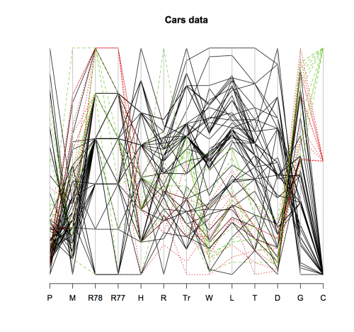

[](http://quantlet.de/index.php?p=info)

## [](http://quantlet.de/) **SMSpcpcar** [](http://quantlet.de/d3/ia)


```yaml

Name of Quantlet: SMSpcpcar

Published in: Multivariate Statistics: Exercises and Solutions

Description: 'Computes parallel coordinates plots for multivariate car data. It allows to capture the structure of multivariate data in a 2 dimensional space. Parallel lines indicate a positive relationship between the variables. The full black line marks U.S. cars, the dotted red line marks Japanese cars, and the dashed blue line marks European cars. Variables 7 (trunk space) to 11 (displacement) imply that US cars are larger than European or Japanese cars. The strong intersection of Variable 1 (price) and 2 (mileage) indicates a strong negative relationship between both variables. As relationships between variables are only visible between neighbouring variables other data visualization techniques are recommended.'

Keywords: PCP, data visualization, graphical representation, parallel coordinates plots, pcp, plot, visualization

See also: 'SMSandcurpopu, SMSboxbank6, SMSboxunemp, SMSboxunemp, SMSdenbank, SMSdenbank, SMSdrafcar, SMSdrafcar, SMSfacenorm, SMSfacenorm, SMShiscar, SMShiscar, SMShisheights, SMShisheights, SMSpcpcar, SMSpcpcar, SMSscanorm2, SMSscanorm3, SMSscanorm3, SMSscapopu, SMSscapopu'

Author[r]: Wolfgang K. Härdle, Zdenek Hlávka, Dedy D. Prastyo
Author[m]: Wolfgang K. Härdle, Ji Cao, Song Song, Vladimir Georgescu, Awdesch Melzer

Submitted:  Fri, August 07 2015 by Awdesch Melzer

Datafile[r]: carc.rda
Datafile[m]: carc.txt

Example: 'Parallel coordinates plot for car data.'
```





```R
rm(list=ls(all=TRUE))
graphics.off()

# load data
load("carc.rda")

# install and load packages
libraries = c("MASS")
lapply(libraries, function(x) if (!(x %in% installed.packages())) {
  install.packages(x)
})
lapply(libraries, library, quietly = TRUE, character.only = TRUE)

parcoord(sapply(carc[,1:13],as.numeric),col=as.numeric(carc$C),lty=as.numeric(carc$C)-(carc$C=="Europe")+(carc$C=="Japan"),lwd=1,main="Cars data")
```
