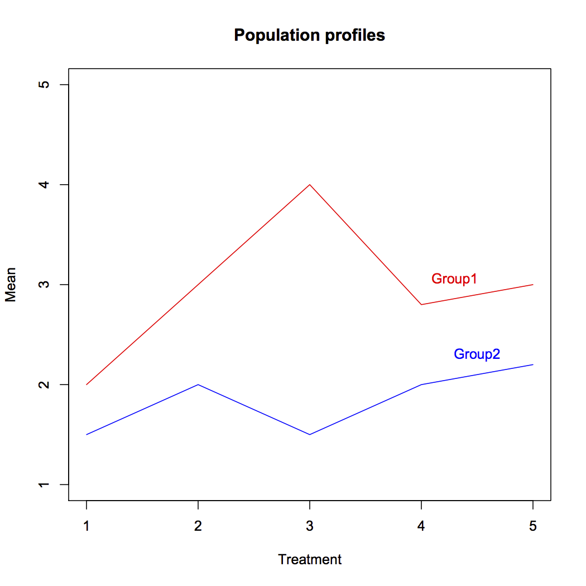

[](http://quantlet.de/index.php?p=info)

## [](http://quantlet.de/) **SMSprofil** [](http://quantlet.de/d3/ia)


```yaml
Name of Quantlet: SMSprofil

Published in: Multivariate Statistics: Exercises and Solutions Series 

Description: 'Plots an example of population profiles to compare the effect of a treatment'

Keywords: 'profile, plot, data visualization, visualization, graphical representation'

Keywords[new]: 'treatment'

See also: 'SMSlinregbank2, SMSlinregvocab, SMSprofil, SMSprofplasma, SMStestcov, SMStestcov4i, SMStestcovwais, SMStestsim, SMStestuscomp'

Author[r]:   Barbora Lebduskova
Author[m]:   Awdesch Melzer

Example[r]: 'Plot of a treatment profile.'

Example[m]: 'Plot of a treatment profile.'
```





```R


x=c(2,3,4,2.8,3)
xx=c(1.5,2,1.5,2,2.2)
y=1:5
plot(y~y,xlab="Treatment",ylab="Mean",main="Population profiles",type="n")
lines(x,col="red")
lines(xx,col="blue")
text(4.3,3.05,"Group1",col="red")
text(4.5,2.3,"Group2",col="blue")

```
