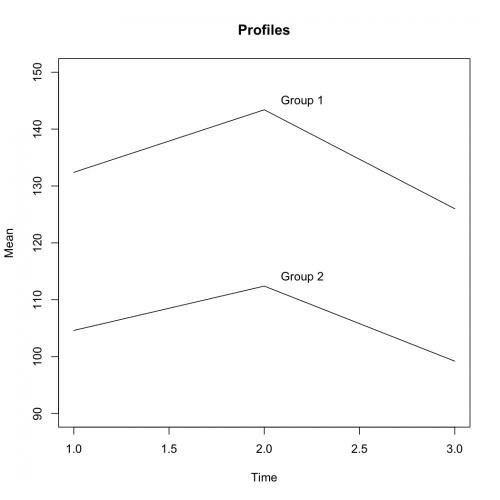

[](http://quantlet.de/index.php?p=info)

## [](http://quantlet.de/) **SMSprofplasma** [](http://quantlet.de/d3/ia)


```yaml
Name of Quantlet: SMSprofplasma

Published in: Multivariate Statistics: Exercises and Solutions Series 

Description: 'Provides a profile analysis of citrate concentrations in plasma.'

Keywords: 'profile, hypothesis-testing, Testing'

See also: 'SMSanovapull, SMSdete2pull, SMSdeterpull, SMSlinregpull, SMSscabank45, SMScovbank'

Author[r]:   Zdenek Hlavka
Author[m]:   Awdesch Melzer

Output: Test of different hypotheses

Datafile[r]: plasma.rda
Datafile[m]: plasma.dat

Example[r]: 'profile analysis of citrate concentrations in plasma'
Example[m]: 'profile analysis of citrate concentrations in plasma'

```





```R
# clear variables and close windows
rm(list=ls(all=TRUE))
graphics.off()

# setwd("C:/...") # set working directory
load("plasma.rda")

plasma[,1] = factor(rep(c("Group 1","Group 2"),each=5))

plot(rbind(c(1,90),c(3,150)),type="n",ylab="Mean",xlab="Time",main="Profiles")
profiles  = t(apply(plasma[,2:4],2,tapply,plasma$group,mean))
tmp       = apply(profiles,2,lines)
text(x=2.2,y=145,"Group 1")
text(x=2.2,y=114,"Group 2")

cov.pool  = (4/5)*(cov(plasma[1:5,2:4])+cov(plasma[6:10,2:4]))/2
diff      = profiles[,1]-profiles[,2]
c         = cbind(diag(rep(1,2)),rep(0,2))-cbind(rep(0,2),diag(rep(1,2)))

n1        = 5       # size population 1
n2        = 5       # size population 2
p         = 3       # number of variables to estimate
n         = n1 + n2 # pooled population size

## are the profiles parallel?

test1     = ((n1*n2*(n1+n2-p))/((n^2)*(p-1)))*t(c%*%diff)%*%solve(c%*%cov.pool%*%t(c))%*%c%*%diff
test1
qf(0.95,2,7)

## test the equality of parallel profiles

ones      = rep(1,3)
test2     = ((n1*n2*(n1+n2-2))/((n^2)))*(t(ones)%*%diff)^2/(t(ones)%*%cov.pool%*%ones)
test2
qf(0.95,1,8)

## test horizontality of parallel profiles

meanprf   = apply(profiles,1,mean)
test3     = ((n1+n2-p)/(p-1))*t(c%*%meanprf)%*%solve(c%*%cov.pool%*%t(c))%*%c%*%meanprf
test3
qf(0.95,2,7)

```
