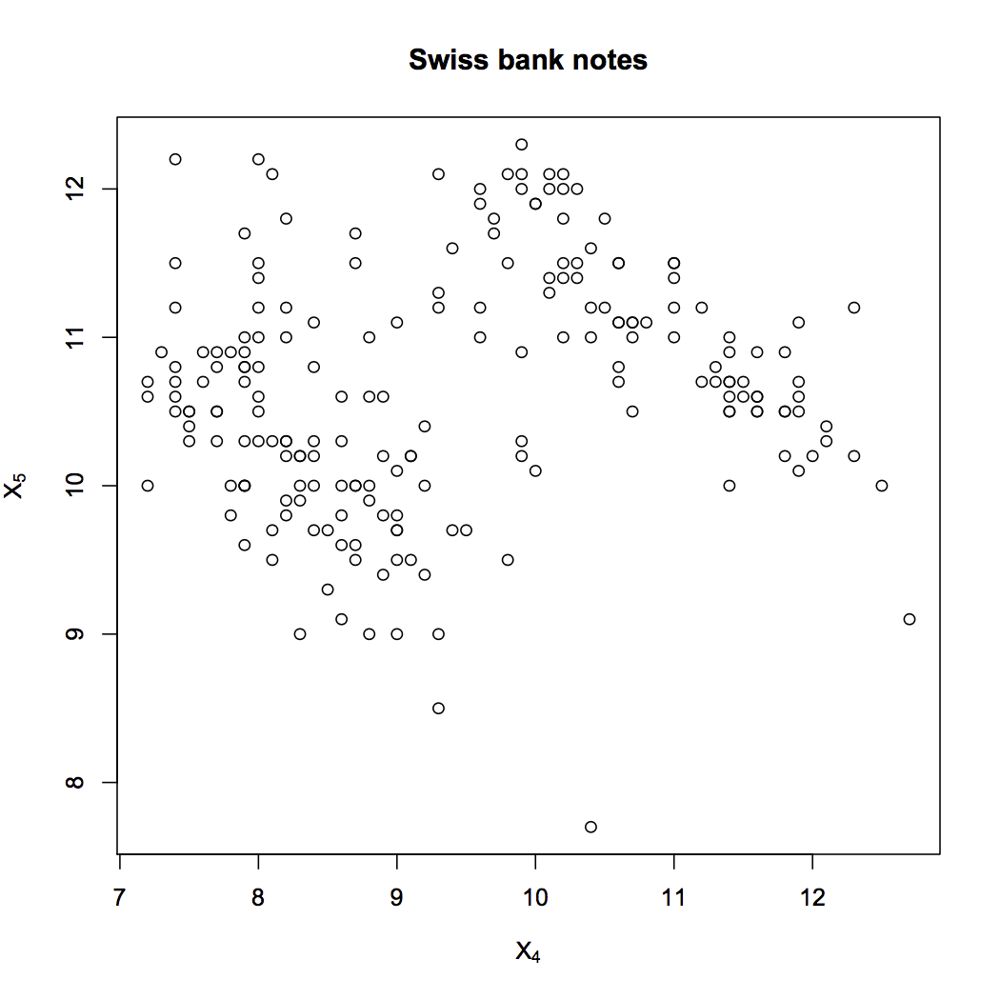

[](http://quantlet.de/index.php?p=info)

## [](http://quantlet.de/) **SMSscabank45** [](http://quantlet.de/d3/ia)


```yaml
Name of Quantlet: SMSscabank45

Published in: Multivariate Statistics: Exercises and Solutions Series 

Description: 'computes a two dimensional scatterplot of X4 vs. X5 (upper inner frame vs. lower) of the Swiss bank notes data.'

Keywords: 'scatterplot, data visualization, graphical representation, plot, visualization'

See also: 'SMSanovapull, SMSdete2pull, SMSdeterpull, SMSlinregpull, SMSscabank45, SMScovbank'

Author[r]:   Zdenek Hlavka
Author[m]:   Awdesch Melzer

Datafile[r]: bank2.rda
Datafile[m]: bank2.dat

Example: 'Two dimensional scatterplot of X4 vs. X5 (upper inner frame vs. lower) of the Swiss bank notes data'

```





```R
# ---------------------------------------------------------------------
# Book:         SMS
# ---------------------------------------------------------------------
# Quantlet:     SMSscabank45
# ---------------------------------------------------------------------
# Description:  SMSscabank45 computes a two dimensional scatterplot of
#               X4 vs. X5 (upper inner frame vs. lower) of the Swiss
#               bank notes data (bank2.dat).
# ---------------------------------------------------------------------
# See also:     SMSanovapull, SMSdete2pull, SMSdeterpull, SMSlinregpull,
#               SMSscabank45, SMScovbank
# ---------------------------------------------------------------------
# Usage:        -
# ---------------------------------------------------------------------
# Keywords:     scatterplot, data visualization, graphical representation
# ---------------------------------------------------------------------
# Inputs:       None
# ---------------------------------------------------------------------
# Output:       Two dimensional scatterplot of X4 vs. X5 (upper inner
#               frame vs. lower) of the Swiss bank notes data
#               (bank2.dat).
# ---------------------------------------------------------------------
# Example:      -
# ---------------------------------------------------------------------
# Author:       Zdenek Hlavka
# ---------------------------------------------------------------------

# clear variables and close windows
rm(list=ls(all=TRUE))
graphics.off()

# set working directory
# setwd("C:/...")

# load data
load("bank2.rda")

# scatterplot
plot(bank2[,c(4,5)],main="Swiss bank notes",xlab=expression(X[4]),ylab=expression(X[5]))

```
