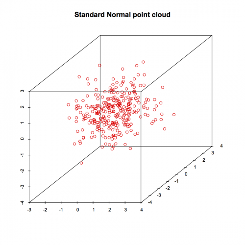

[](http://quantlet.de/index.php?p=info)

## [](http://quantlet.de/) **SMSscanorm3** [](http://quantlet.de/d3/ia)


```yaml

Name of Quantlet: SMSscanorm3

Published in: Multivariate Statistics: Exercises and Solutions

Description: 'Computes a three dimensional scatterplot of simulated multivariate standard normal random numbers.'

Keywords: '3D, data visualization, graphical representation, multivariate, multivariate normal, random-number-generation, scatterplot, simulation, standard-normal, visualization'

See also: 'SMSandcurpopu, SMSboxbank6, SMSboxunemp, SMSboxunemp, SMSdenbank, SMSdenbank, SMSdrafcar, SMSdrafcar, SMSfacenorm, SMSfacenorm, SMShiscar, SMShiscar, SMShisheights, SMShisheights, SMSpcpcar, SMSpcpcar, SMSscanorm2, SMSscanorm3, SMSscanorm3, SMSscapopu, SMSscapopu'

Author[r]: Alena Babiakova
Author[m]: Awdesch Melzer

Submitted:  Fri, August 07 2015 by Awdesch Melzer

Example: 'Three dimensional scatterplot of simulated multivariate normal random numbers'
```





```R
rm(list=ls(all=TRUE))
graphics.off()

# install and load packages
libraries = c("MASS", "scatterplot3d")
lapply(libraries, function(x) if (!(x %in% installed.packages())) {
  install.packages(x)
})
lapply(libraries, library, quietly = TRUE, character.only = TRUE)

set.seed(100);                             # pseudorandom numbers

n     = 300;                               # number of observations
mu    = c(0,0,0);                          # mean
sigma = diag(x = 1, nrow = 3, ncol = 3);   # covariance matrix

x     = mvrnorm(n, mu, sigma);             # multivariate normal random numbers

scatterplot3d(x, color = "red", main = "Standard Normal point cloud", grid = FALSE,xlab="",ylab="",zlab="");

```
