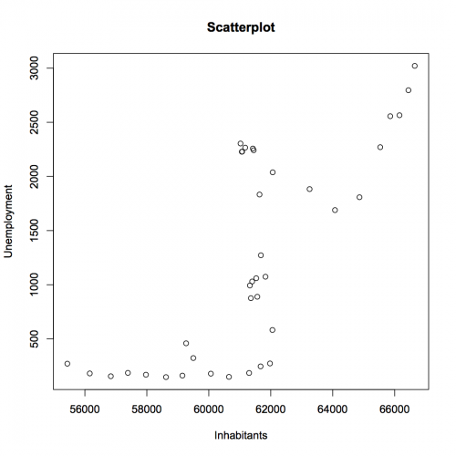

[](http://quantlet.de/index.php?p=info)

## [](http://quantlet.de/) **SMSscapopu** [](http://quantlet.de/d3/ia)


```yaml

Name of Quantlet: SMSscapopu

Published in: Multivariate Statistics: Exercises and Solutions

Description: 'It produces scatterplot from the annual population dataset. Evidently, the data is structured in two segments. A first part with lower values of unemployment and a second part with higher values of unemployment.'

Keywords: data visualization, graphical representation, plot, scatterplot, visualization

See also: 'SMSandcurpopu, SMSboxbank6, SMSboxunemp, SMSboxunemp, SMSdenbank, SMSdenbank, SMSdrafcar, SMSdrafcar, SMSfacenorm, SMSfacenorm, SMShiscar, SMShiscar, SMShisheights, SMShisheights, SMSpcpcar, SMSpcpcar, SMSscanorm2, SMSscanorm3, SMSscanorm3, SMSscapopu, SMSscapopu'

Author[r]: Jakub Petrasek
Author[m]: Awdesch Melzer

Submitted:  Fri, August 07 2015 by Awdesch Melzer

Datafile[r]: annualpopu.rda
Datafile[m]: annualpopu.dat

Example: 'scatterplot from the population dataset'
```





```R
rm(list=ls(all=TRUE)) 
graphics.off() 

load("annualpopu.rda") 

plot(Unemployed~Inhabitants, xlab="Inhabitants", ylab="Unemployment", main="Scatterplot", data=annualpopu) 

```
