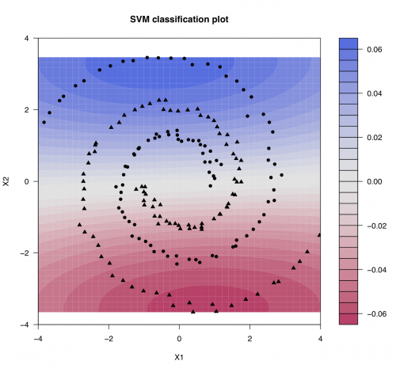
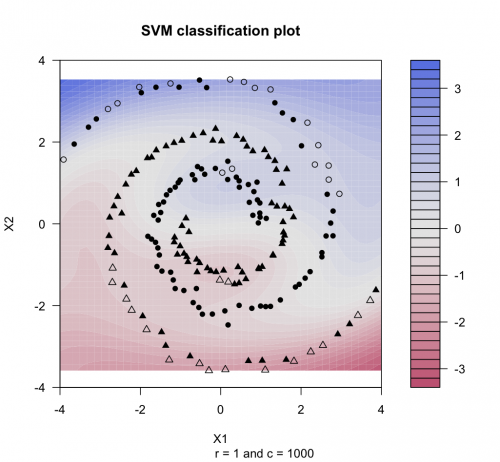
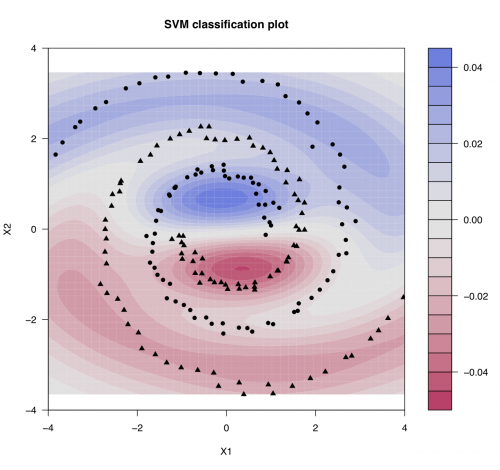
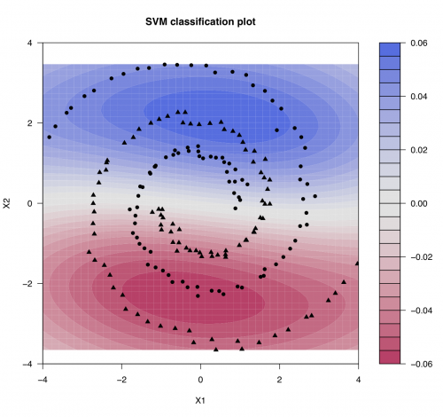

[](http://quantlet.de/index.php?p=info)

## [](http://quantlet.de/) **SMSsvmspiral** [](http://quantlet.de/d3/ia)


```yaml
Name of Quantlet: SMSsvmspiral

Published in: Multivariate Statistics: Exercises and Solutions

Description: 'plots the area of two different groups via svm classification using anipotropic Gaussian kernel for artificial spiral data'

Keywords: 'support vector machines, svm, classification, kde, kernel density estimation, anisotropic kernel, kernel'

See also: 'SMScartdiag, SMScartsq, SMSdisfbank2, SMSeppbank, SMSsimpdbank, SMSsimpdsimu, SMSsir2cars, SMSsir2simu, SMSsircars, SMSsirsimu, SMSsircars, SMSsirsimu, SMSsiruscomp, SMSsvmbankrupt, SMSsvmorange, SMSsvmspiral'

Author: Wolfgang Härdle, Dedy Dwi Prastyo, Awdesch Melzer

Example: '2-dim plot of a svm classification for spiral data using anisotropic Gaussian kernel.'
```








```R
# clear history, close windows
rm(list=ls(all=TRUE))
graphics.off()


# install and load packages
libraries = c("kernlab","tseries","quadprog","zoo")
lapply(libraries, function(x) if (!(x %in% installed.packages())) {
    install.packages(x)})
lapply(libraries, library, quietly = TRUE, character.only = TRUE)  

set.seed(1)
# Generating spiral data

tetha = seq(length=100, from=0, to=3)

a     = 1
b     = 0.5 	 # b is near to zero, spiral approaches a circle

r     = a*exp(b*tetha)

# X(+1) members of first group, centering in (c1p,c2p)

c1p   = 0
c2p   = 0

X1p   = c1p + r*cos(tetha*pi)
X2p   = c2p + r*sin(tetha*pi)

# X(-1) members of second group, centering in (c1n,c2n)

c1n   = 1
c2n   = 0

X1n   = 1 - (c1n + r*cos(tetha*pi))
X2n   = - (c2n + r*sin(tetha*pi))

# Agregating data

X1    = c(X1p, X1n)
X2    = c(X2p, X2n)

# generating indicator variable

yp    = array(1:100, dim=c(100,1))
yn    = array(1:100, dim=c(100,1))


for (i in 1:100){ 
	yp[i] = 1
	yn[i] = -1
}

Y     = c(yp,yn)

# Generating noise, N(0,0.01)

e     = rnorm(200, mean = 0, sd = 0.1)

X1    = X1 + e
X2    = X2 + e

Spiral.noise = cbind(X2, X1)

# --------------------------------------------------------------------------


# Main program for SVM classification plot
# read simulated data
  
sgm = c(0.2,8,0.2,8)   
C = c(0.1,0.1,8,8)

for (i in 1:4){
 
  SpiralModel = ksvm(Spiral.noise, Y, type="C-svc", kernel="rbfdot", kpar=list(sigma=sgm[i]), C=C[i], prob.model=TRUE, cross=4)
  str = paste("s=",sprintf("%0.1f",sgm[i]),", c=",sprintf("%0.1f",C[i]),"                          ",sep="")
  plot(SpiralModel, data=Spiral.noise,cex=0.7,cex.main=1.5)
  title(sub=str)
  print(SpiralModel)
}


```
